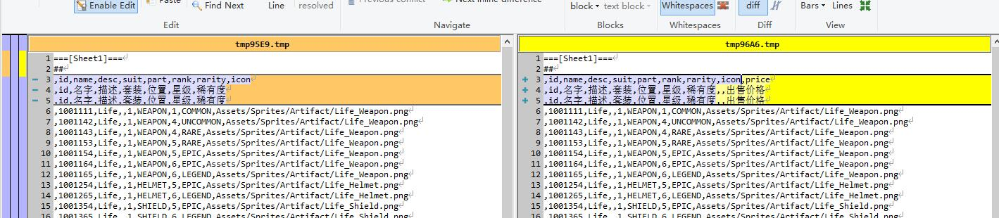
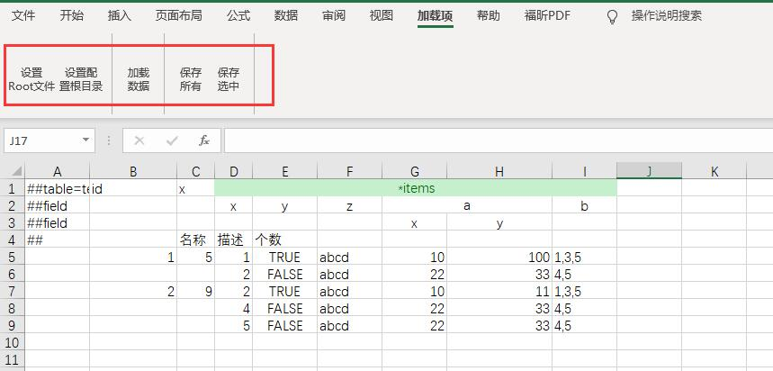

# Luban

[](https://opensource.org/licenses/MIT)
[](https://travis-ci.com/focus-creative-games/luban)  


-----
## links
- [README - English](./README.en-us.md)
- [github link](https://github.com/focus-creative-games/luban)
- [gitee link](https://gitee.com/focus-creative-games/luban)
----

## 介绍


在中大型游戏项目中，excel配置表时常出现较复杂的数据结构，常规的导表工具面对此类需求要么无法支持，要么就强迫策划和程序使用拆表等奇技淫巧，严重影响设计和开发效率。另外具有复杂GamePlay的游戏中，技能、行为树、关卡之类的功能有非常复杂的数据结构，往往使用自定义编辑器制作，并以json、xml等文件格式保存，以excel为中心的导表工具无法处理这些数据，给策划和程序的工作流带来麻烦。

luban相较于常规的excel导表工具有以下核心优势：
- 增强了excel格式。可以比较简洁地excel配置**任意复杂**的数据，像子结构、结构列表，以及更复杂的深层次的嵌套结构都能直接解析处理。
- 完备的类型系统和多原始数据支持（xml、json、lua、yaml），可以轻松表达和解析**任意复杂**的数据。意味着传统excel导表工具无法处理的技能、行为树、副本等等复杂配置，luban也能够统一处理了，彻底将程序从复杂的配置解析中完全解放出来。
- 完善的工作流支持。如id的外键引用检查;资源合法性检查;灵活的数据源定义（拆表或者多表合一）;灵活的分组导出机制；多种本地化支持;生成极快（日常迭代300ms以内）；Excel2TextDiff工具方便diff查看excel文件的版本间差异；
- **=== LubanAssistant Excel插件 ===**。支持把json、lua、xml等文本格式的配置数据加载到excel中，批量编辑处理，最后再保存回原文件，较好地解决大型项目中多人合作数据编辑冲突合并的问题，较好解决在编辑器中制作的配置难以在excel中批量修改的问题。

====**如果觉得不错，烦请点个star，你的支持会给予我们巨大动力 ^_^**====

## 文档

- [主页](https://focus-creative-games.github.io/luban/index.html)
- [特性](docs/traits.md)
- [快速上手](docs/install.md)
- [Excel 配置数据简介](docs/data_excel.md)
- [client&server安装与使用说明](docs/luban_install_manual.md)
- [文档目录](docs/catalog.md)
- [完整手册](docs/manual.md)
- **示例项目** ([github](https://github.com/focus-creative-games/luban_examples)) ([gitee](https://gitee.com/focus-creative-games/luban_examples))

- 支持与联系
  - QQ群: 692890842 （Luban开发交流群）。有使用方面的疑问请及时加QQ群询问，随时有人帮助解决。
  - 邮箱: taojingjian#gmail.com

## 特性
- 支持excel族、json、xml、lua、yaml 多种数据格式，基本统一了游戏常见的配置数据
- **强大完备的类型系统**。**可以优雅表达任意复杂的数据结构**。支持所有常见原生类型、datetime类型、容器类型list,set,map、枚举和结构、**多态结构**以及**可空类型**。
- 支持增强的excel格式。可以在excel里比较简洁填写出非常复杂的数据（比如顶层字段包含"list,A"类型字段， 而A是结构并且其中又包含"list,B"类型字段，B也是结构并且包含"list,C"这样的字段...）。
- 生成代码清晰易读、良好模块化。特地支持运行时原子性热更新配置。
- 生成极快。支持常规的本地缓存增量生成模式，也支持云生成模式。MMORPG这样大型项目也能秒内生成。日常增量生成基本在300ms以内，项目后期极大节省了迭代时间。另外支持**watch监测模式**，数据目录变化立即重新生成。
- 灵活的数据源定义。一个表可以来自多个文件或者一个文件内定义多个表或者一个目录下所有文件甚至来自云表格，以及以上的组合
- 支持表与字段级别分组。可以灵活定义分组，选择性地导出客户端或者服务器或编辑器所用的表及字段
- 多种导出数据格式支持。支持binary、json、lua、xml 等导出数据格式
- 强大灵活的定制能力
	- 支持代码模板，可以用自定义模板定制生成的代码格式
	- **支持数据模板**，可以用模板文件定制导出格式。意味着可以在不改动现有程序代码的情况下，把luban当作**配置处理前端**，生成自定义格式的数据与自己项目的配置加载代码配合工作。开发已久的项目或者已经上线的老项目，也能从luban强大的数据处理工作流中获益
- 支持数据标签。 可以选择导出符合要求的数据，发布正式数据时策划不必手动注释掉那些测试数据了
- 强大的数据校验能力。支持内建数据格式检查；支持ref表引用检查（策划不用担心填错id）;支持path资源检查（策划不用担心填错资源路径）;支持range检查
- 支持常量别名。策划不必再为诸如 升级丹 这样的道具手写具体道具id了
- 支持多种常见数据表模式。 one(单例表)、map（常规key-value表）
- 支持res资源标记。可以一键导出配置中引用的所有资源列表(icon,ui,assetbundle等等)
- 统一了自定义编辑器的配置数据。与Unity和UE4的自定义编辑器良好配合，为编辑器生成合适的加载与保存json配置的的c#(Unity)或c++(UE4)代码。保存的json配置能够被luban识别和处理。
- 支持emmylua anntations。生成的lua包含符合emmylua 格式anntations信息。配合emmylua有良好的配置代码提示能力
- **本地化支持**
 	- 支持时间本地化。datetime类型数据会根据指定的timezone，转换为目标地区该时刻的UTC时间，方便程序使用。
	- 支持文本静态本地化。导出时所有text类型数据正确替换为最终的本地化字符串。绝大多数的业务功能不再需要运行根据本地化id去查找文本的内容，简化程序员的工作。
	- 支持文本动态本地化。运行时动态切换所有text类型数据为目标本地化字符串。
	- 支持 main + patches 数据合并。在基础数据上，施加差分数据，生成最终完整数据，适用于制作有细微不同的多地区的配置数据。
	- [TODO] 【独创】 支持任意粒度和任意类型数据（如int,bean,list,map）的本地化。 
- 支持主流的游戏开发语言
   - c++ (11+)
   - c# (.net framework 4+. dotnet core 3+)
   - java (1.6+)
   - go (1.10+)
   - lua (5.1+)
   - js 和 typescript (3.0+)
   - python (3.0+)
   - erlang (18+)
   - rust (1.5+)
- 支持主流引擎和平台
   - unity + c#
   - unity + [tolua](https://github.com/topameng/tolua)、[xlua](https://github.com/Tencent/xLua)
   - unity + [ILRuntime](https://github.com/Ourpalm/ILRuntime)
   - unity + [puerts](https://github.com/Tencent/puerts)
   - unity + [GameFramework](https://github.com/EllanJiang/GameFramework)
   - unity + [ET游戏框架](https://github.com/egametang/ET)
   - unreal + c++
   - unreal + [unlua](https://github.com/Tencent/UnLua)
   - unreal + [sluaunreal](https://github.com/Tencent/sluaunreal)
   - unreal + [puerts](https://github.com/Tencent/puerts)
   - cocos2d-x + lua
   - cocos2d-x + js
   - [skynet](https://github.com/cloudwu/skynet)
   - 微信小程序平台
   - 其他家基于js的小程序平台
   - 其他所有支持lua的引擎和平台
   - 其他所有支持js的引擎和平台
- 扩展工具
	- Excel2TextDiff。将excel转成文本后再diff，清晰对比excel版本之间内容变化。
	- **LubanAssistant**，Luban的Excel插件。支持把json、lua、xml等文本格式的配置数据加载到excel中，批量编辑处理，最后再保存回原文件，较好地解决大型项目中多人合作数据编辑冲突合并的问题，较好解决在编辑器中制作的配置难以在excel中批量修改的问题。


## 增强的excel格式
luban支持在excel中解析任意复杂的数据结构，哪怕复杂如技能、行为树（但在实践中一般使用编辑器制作这些数据，以json格式保存，而不会在excel里填写）。下面从简单到复杂展示在luban中配置这些数据的方式。


### 原生数据类型

支持 bool,int,float,string,text,datetime,vector2,vector3,vector4 等等类型，它们的填写跟常规认知一致。


### 原生数据列表

array与list类型都能表示列表，它们区别在于array生成的代码为数组，而list生成代码为列表。例如"array,int"生成的c#代码类型为 int[]，而"list,int"生成的c#代码类型为 List&lt;int&gt;。


### 枚举

```xml
<enum name="ItemQuality">
	<var name="WHITE" alias="白" value="0"/>
	<var name="GREEN" alias="绿" value="1"/>
	<var name="RED" alias="红" value="2"/>
</enum>
```


### 嵌套子结构
经常会碰到，某个字段是结构，尤其这个结构在很多配置里都会复用。

假设任务中包含一个 任务线索 字段

```xml
<bean name="QuestClue">
	<var name="desc" type="string"/>
	<var name="npc_id" type="int"/>
	<var name="location" type="vector3"/>
</bean>
```


### 简单结构列表
某个字段为结构列表的情形也很常见，比如说奖励信息列表包含多个奖励信息，每个奖励都有多个字段。

假设礼包中包含一个道具信息列表字段。支持3种填写模式，具体选择由策划灵活决定。
- 所有字段完全展开，每个单元格填一个元素。缺点是占用的列较多。如items1字段。
- 每个结构占据一个单元格，使用sep分割结构子字段。如items2字段。
- 整个列表占据一个单元格，使用sep分割列表及结构子字段。如items3字段。

```xml
<bean name="Reward">
	<var name="item_id" type="int"/>
	<var name="count" type="int"/>
	<var name="desc" type="string">
</bean>
```


### 多行结构列表
有时候列表结构的每个结构字段较多，如果水平展开则占据太多列，不方便编辑，如果拆表，无论程序还是策划都不方便，此时可以使用多行模式。支持任意层次的多行结构列表（也即多行结构中的每个元素也可以是多行）， name&multi_rows=1或者  *name 都可以表达一个多行解析的字段。

假设每个任务包含多个阶段，有一个阶段列表字段。

```xml
<bean name="Stage">
	<var name="id" type="int"/>
	<var name="name" type="string"/>
	<var name="desc" type="string"/>
	<var name="location" type="vector3"/>
	<var name="reward_item_id" type="int"/>
	<var name="reward_item_count" type="int"/>
</bean>
```


### 单例表
有一些配置全局只有一份，比如 公会模块的开启等级，背包初始大小，背包上限。此时使用单例表来配置这些数据比较合适。


### 纵表

大多数表都是横表，即一行一个记录。有些表，比如单例表，如果纵着填，一行一个字段，会比较舒服。meta行添加 orientation=c 则使用纵表模式来填写内容。 上面的单例表，以纵表模式填如下。


### 引用检查
游戏配置中经常要填写诸如道具id之类的外键数据，这些数据必须是合法的id值，luban支持生成时检查id的合法性，如果有误，则打出警告。

只要字段定义中添加 ref="表全名" 即可。不只是表顶层字段，列表及嵌套结构的子字段也支持完整的引用检查。

```xml
<bean name="Reward">
	<var name="item_id" type="int" ref="item.TbItem"/>
	<var name="count" type="int"/>
	<var name="desc" type="string">
</bean>
```


### 资源检查
配置中经常要填写资源路径，比如道具icon的资源，这些数据都是string类型，非常容易填写出错，导致运行时无法正常显示。luban支持unity与ue4资源的合法性检查以及通用型文件路径检查。不只是表顶层字段，列表及嵌套结构的子字段也支持完整的引用检查。

对于这些字段添加属性 path=unity或者path=ue或path=normal;xxxx。


### 分组导出
灵活的分组定义，不仅仅是client和server分组。支持以下分组粒度：

- 表级别分组
- 字段级别分组(任意bean字段粒度，而不仅限于顶层字段)

### 数据标签过滤

开发期经常会制作一些仅供开发使用的配置，比如测试道具，比如自动化测试使用的配置，希望在正式发布时不导出这些数据。 


## 高级特性
### 层级标题头 (hierarchy title)
在多行数据或者深层次嵌套的数据中，如果数据字段较多，填写时不易区分子元素。luban提供层级标题实现深层次的子字段对应。以上面的多行数据列表为例。


### 可空数据类型
配置数据中经常有空值的语义需求，实际项目中往往混杂地使用0或-1表达空值，既不自然清晰也不统一。luban借鉴了c#中的可空变量的概念，特地提供可空数据支持。所有原生数据类型，以及enum、bean、和多态bean类型都有相应的可空数据类型。定义方式为 <类型名>?，与c#里的Nullable类型定义方式相同。例如 bool?,int?,long?,double?, EColor?, DemoType?


### 类型继承(inheritance)
支持OOP的类型继承体系，方便表达多类型的数据，常用于技能、AI等模块。类型继承是luban类型系统的灵魂，如果没有类型继承，不可能简洁地表达任意复杂数据结构，因而也不可能定义并且从配置中读取复杂的配置数据。

实践中像技能和AI之类的数据，一般用编辑器制作，使用json之类的格式保存，而不是在excel中编辑。

```xml
<bean name="Shape">
	<bean name="Circle">
		<var name="radius" type="float"/>
	</bean>
	<bean name="Rectangle" alias="长方形">
		<var name="width" type="float"/>
		<var name="height" type="float"/>
	</bean>
	<bean name="Curve">
		<bean name="Line" alias="直线">
			<var name="param_a" type="float"/>
			<var name="param_b" type="float"/>
		</bean>
		<bean name="Parabola" alias="抛物线">
			<var name="param_a" type="float"/>
			<var name="param_b" type="float"/>
		</bean>
	</bean>
</bean>

```


### 字段默认值
我们希望excel中单元格留空时，该字段取指定值，而不是默认的false,0之类。通过定义字段的default=xxx属性来指定默认值。

如示例，id=2的记录，x1与x2皆为空，x1=0,x2=-1。


### 常量别名

游戏里经常会出现一些常用的类似枚举的值，比如说 升级丹的 id,在很多地方都要填，如果直接它的道具 id,既不直观，也容易出错。 Luban 支持常量替换。对于需要常量替换的字段，添加 convert=”枚举类”。 如果填写的值是 枚举名或者别名，则替换为 相应的整数。否则 按照整数解析。

``` xml
<enum name="EFunctionItemId">
	<var name="SHENG_JI_DAN" alias="升级丹" value="11220304"/>
	<var name="JIN_JIE_DAN" alias="进阶丹" value="11220506"/>
</enum>
```


导出时，升级丹会被替换为11220304。

### 灵活的配置文件组织形式
支持以下几种组织形式，允许开发者根据情况灵活组织配置文件结构。例如可以一个表对应一个xlsx文件；可以多个表都放到同个xlsx文件；可以一个表对应多个xlsx文件；可以一个表对应一个目录。

- 来自某个excel文件的所有单元薄
- 来自某个excel文件的指定单元薄
- 来自json、xml、lua、yaml文件
- 来自目录树下所有文件，每个文件对应一个记录
- 以上的随意组合

### 其他数据源

- [json](docs/data_json.md)
- [lua](docs/data_lua.md)
- [xml](docs/data_xml.md)
- [yaml](docs/data_yaml.md)

### 多种导出数据格式
支持以下几种导出数据格式
- binary
- json
- lua
- erlang
- 使用模板自定义生成数据格式(只支持文本型数据格式)

binary格式加载最快，json加载速度其次，lua加载最慢。

binary格式占空间最小，lua其次，json最大。

不同的导出类型只影响导出的数据大小和加载数据的性能，不影响结构定义以及最终加载到内存占用。

**不同的导出数据类型对程序和策划是透明的，切换不影响数据编辑方式和业务代码中使用配置的方式。**

### 编辑器支持

支持生成c#(用于unity)和c++(用于UE4)的json配置加载与保存代码，方便制作编辑器的同学加载与保存符合luban配置格式的数据。

### 自定义代码和数据模板

[自定义模板](docs/render_template.md)

### 本地化
支持以下几种本地化机制，详见[本地化](docs/l10n.md)
- 静态本地化
- 动态本地化
- 多分支数据
- 时间本地化
- [TODO] 任意粒度的数据本地化（不仅仅是text及记录级别）


## Excel2TextDiff
将excel文件转成text，再调用diff工具对比。与TortoiseGit、TortoiseSvn等版本管理工具良好配合。



## [LubanAssistant](https://github.com/focus-creative-games/Tools/LubanAssistant) Excel插件。神器！
对于多人协作编辑的配置表，如何以xlsx格式保存配置，很容易出现数据冲突覆盖的问题，在大型项目中尤为严重。另外合并多分支数据时，xlsx无法像文本文件那样自动解决冲突，给项目的版本维护带来很大麻烦。

一个合理的解决思路是，以json、xml之类格式保存配置数据，在excel中编辑。LubanAssistant较好地解决了这个问题，使用者既享受luban强大的数据处理能力、同时拥有json良好的可阅读性及多版本可维护性，还能兼顾excel的便捷的编辑能力。



id为1的记录对应的内容如下
```json
{
  "x4": 1,
  "x1": true,
  "x5": 100,
  "x6": 1.20000005,
  "s1": "hq",
  "s2": {
    "key": "/asfa",
    "text": "aabbcc"
  },
  "v2": {
    "x": 1,
    "y": 2
  },
  "v3": {
    "x": 1.10000002,
    "y": 2.20000005,
    "z": 3.4000001
  },
  "v4": {
    "x": 10.1000004,
    "y": 11.1999998,
    "z": 12.3000002,
    "w": 13.3999996
  },
  "t1": "1990-1-1 00:00:00",
  "x12": {
    "x1": 10
  },
  "x13": "A",
  "x14": {
    "__type__": "DemoD2",
    "x1": 1,
    "x2": 2
  },
  "k1": [
    12
  ],
  "k8": [
    [
      2,
      2
    ],
    [
      4,
      10
    ]
  ],
  "k9": [
    {
      "y1": 1,
      "y2": true
    },
    {
      "y1": 2,
      "y2": false
    }
  ],
  "k15": [
    {
      "__type__": "DemoD2",
      "x1": 1,
      "x2": 2
    },
    {
      "__type__": "DemoD2",
      "x1": 2,
      "x2": 3
    }
  ]
}
```


## 代码预览

这儿只简略展示c#、typescript、go语言在开发中的用法，更多语言以及更详细的使用范例和代码见[示例项目](https://github.com/focus-creative-games/luban_examples)。

- C# 使用示例

```C#
// 一行代码可以加载所有配置。 cfg.Tables 包含所有表的一个实例字段。
var tables = new cfg.Tables(file => return new ByteBuf(File.ReadAllBytes(gameConfDir + "/" + file + ".bin")));
// 访问一个单例表
Console.WriteLine(tables.TbGlobal.Name);
// 访问普通的 key-value 表
Console.WriteLine(tables.TbItem.Get(12).Name);
// 支持 operator []用法
Console.WriteLine(tables.TbMail[1001].Desc);
```

- typescript 使用示例

```typescript
// 一行代码可以加载所有配置。 cfg.Tables 包含所有表的一个实例字段。
let tables = new cfg.Tables(f => JsHelpers.LoadFromFile(gameConfDir, f))
// 访问一个单例表
console.log(tables.TbGlobal.name)
// 访问普通的 key-value 表
console.log(tables.TbItem.get(12).Name)
```

- go 使用示例
```go
// 一行代码可以加载所有配置。 cfg.Tables 包含所有表的一个实例字段。
if tables , err := cfg.NewTables(loader) ; err != nil {
	println(err.Error())
	return
}
// 访问一个单例表
println(tables.TbGlobal.Name)
// 访问普通的 key-value 表
println(tables.TbItem.Get(12).Name)

```


## 性能测试数据

硬件：

	Intel(R) Core i7-10700 @ 2.9G 16核
	32G 内存

数据集

	500个excel表
	每个表有1000行比较大的记录
	每个表文件大小 132k

测试结果：

| 格式 | 完整生成耗时 | 增量生成耗时 | 单个输出文件大小 | 输出文件总大小 |
| ---- | --------| ------  | ----            | ------ |
| bin  | 15.652 s| 797 ms  | 164 K            | 59.5 M |
| json | 17.746 s| 796 ms  | 1.11 M           | 555 M   |
| lua  | 17.323 s| 739 ms  | 433 K           | 212 M   |

## 路线图
- [ ] 新增 unity 内置编辑器
- [ ] 新增 unreal 内置编辑器
- [ ] 补充单元测试

## 开发环境架设

- 安装 [VS2019 社区版](https://visualstudio.microsoft.com/zh-hans/vs/)
- 安装 [.dotnet core sdk 5.0](https://dotnet.microsoft.com/download/dotnet/5.0)

## 安装与使用

参见 [client&server安装与使用说明](docs/luban_install_manual.md)

## 如何贡献

- [Contributing](CONTRIBUTING.md) explains what kinds of changes we welcome
- [Workflow Instructions](docs/workflow/README.md) explains how to build and test

## 有用的链接

- [.NET Core source index](https://source.dot.net)

## License

Luban is licensed under the [MIT](LICENSE.TXT) license.
