- [README 中文](./README_zh.md)
- [README English](./README.md)

# Luban


[](https://opensource.org/licenses/MIT) 


luban is a powerful, easy-to-use, elegant, and stable game configuration solution. It is designed to meet the needs of simple to complex game configuration workflows from small to very large game projects.

luban can handle a variety of file types, supports mainstream languages, can generate multiple export formats, supports rich data inspection functions, has good cross-platform capabilities, and generates extremely fast.
Luban has a clear and elegant generation pipeline design, supports good modularization and plug-in, and is convenient for developers to carry out secondary development. Developers can easily adapt luban to their own configuration format, and customize powerful configuration tools that meet project requirements.

Luban standardizes the game configuration development workflow, which can greatly improve the efficiency of planning and programming.

## Core features

- Rich source data format. Support excel family (csv, xls, xlsx, xlsm), json, xml, yaml, lua, etc.
- Rich export formats. Support generating binary, json, bson, xml, lua, yaml and other format data
- Enhanced excel format. Simple configurations such as simple lists, substructures, structured lists, and arbitrarily complex deep nested structures can be concisely configured
- Complete type system. Not only can it express common specification line lists, but it can flexibly and elegantly express complex GamePlay data such as behavior trees, skills, plots, and dungeons because **supports OOP type inheritance**
- Support multiple languages. Supports generating language codes such as c#, java, go, cpp, lua, python, typescript, etc.
- Support mainstream message schemes. protobuf(schema + binary + json), flatbuffers(schema + json), msgpack(binary)
- Powerful data verification capability. ref reference check, path resource path, range range check, etc.
- Perfect localization support
- Supports all major game engines and platforms. Support Unity, Unreal, Cocos2x, Godot, WeChat games, etc.
- Good cross-platform capability. It can run well on Win, Linux, and Mac platforms.
- Support all mainstream hot update solutions. hybridclr, ilruntime, {x,t,s}lua, puerts, etc.
- Clear and elegant generation pipeline, it is easy to carry out secondary development on the basis of luban, and customize a configuration tool suitable for your own project style.

## Documentation

- [Official Documentation](https://luban.doc.code-philosophy.com/)
- [Quick Start](https://luban.doc.code-philosophy.com/docs/beginner/quickstart)
- **Example Project** ([github](https://github.com/focus-creative-games/luban_examples)) ([gitee](https://gitee.com/focus-creative-games/luban_examples) )
- Support and contact
   - QQ group: 692890842 (Luban development exchange group)
   - discord: https://discord.gg/dGY4zzGMJ4
   - Email: luban@code-philosophy.com

## Excel format overview

basic data format

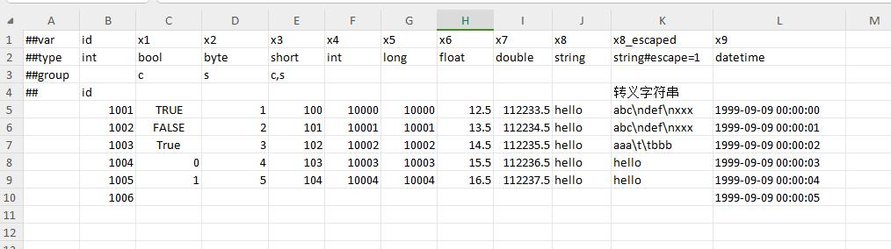

enum data format

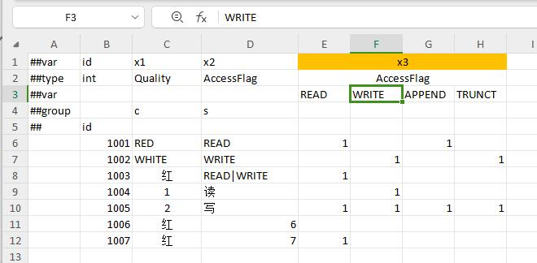

bean data format

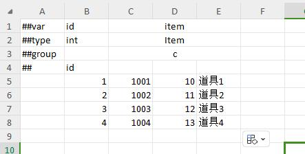

Polymorphic bean data format

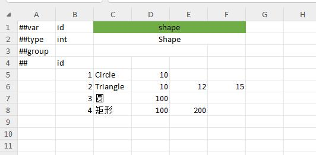

container

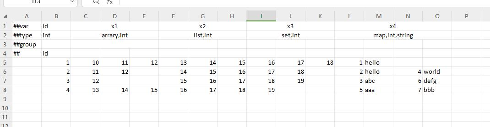

nullable type

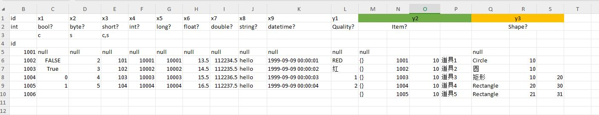

no primary key table

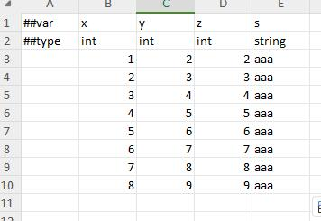

Multi-primary key table (joint index)

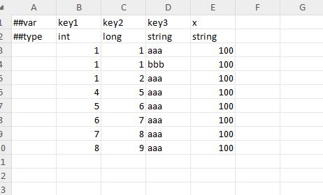

Multi-primary key table (independent index)

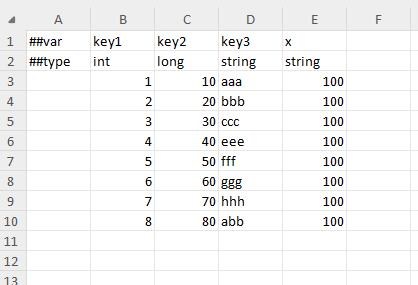

singleton table

Some configurations have only one copy globally, such as the opening level of the guild module, the initial size of the backpack, and the upper limit of the backpack. At this time, it is more appropriate to use a singleton table to configure these data.

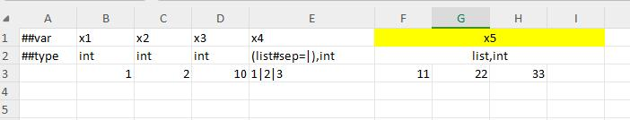

vertical table

Most tables are horizontal tables, that is, one record per row. Some tables, such as singleton tables, are more comfortable to fill in vertically, with one field per line. A1 is ##column means using vertical table mode. The singleton table above is filled in as follows in vertical table mode.

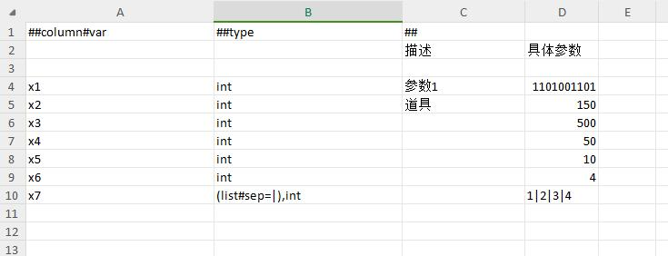

Use sep to read beans and nested beans.

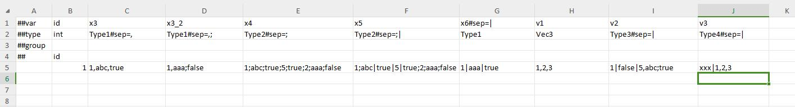

Use sep to read normal containers.

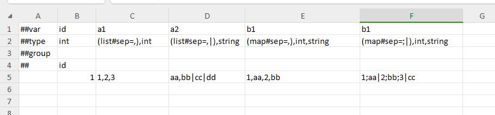

Use sep to read structure containers.

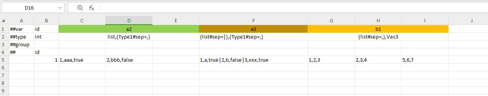


multi-level header

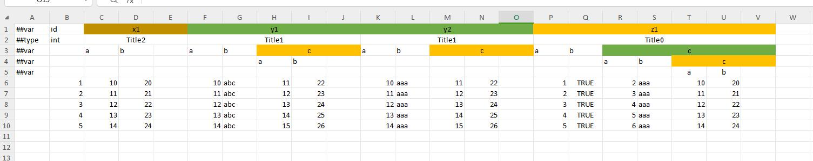

Qualify column format

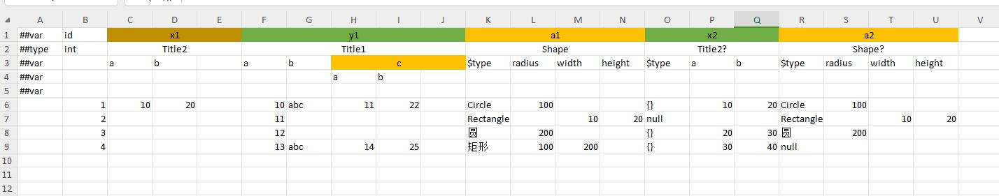

Enumerated column-qualified format


polymorphic bean column qualification format

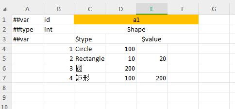

column-qualified format for map

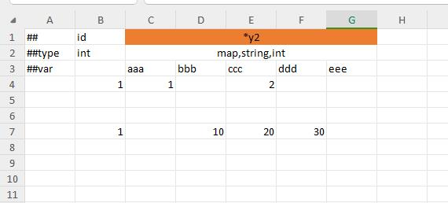


multiline field

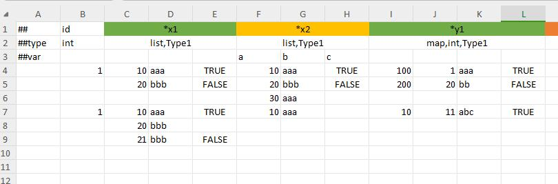

Data label filtering

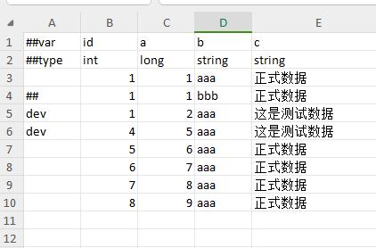


## Overview of other formats

Take behavior tree as an example to show how to configure behavior tree configuration in json format. For xml, lua, yaml and other formats, please refer to [Detailed Documentation](https://luban.doc.code-philosophy.com/docs/intro).

```json
{
   "id": 10002,
   "name": "random move",
   "desc": "demo behavior tree",
   "executor": "SERVER",
   "blackboard_id": "demo",
   "root": {
     "$type": "Sequence",
     "id": 1,
     "node_name": "test",
     "desc": "root",
     "services": [],
     "decorators": [
       {
         "$type": "UeLoop",
         "id": 3,
         "node_name": "",
         "flow_abort_mode": "SELF",
         "num_loops": 0,
         "infinite_loop": true,
         "infinite_loop_timeout_time": -1
       }
     ],
     "children": [
       {
         "$type": "UeWait",
         "id": 30,
         "node_name": "",
         "ignore_restart_self": false,
         "wait_time": 1,
         "random_deviation": 0.5,
         "services": [],
         "decorators": []
       },
       {
         "$type": "MoveToRandomLocation",
         "id": 75,
         "node_name": "",
         "ignore_restart_self": false,
         "origin_position_key": "x5",
         "radius": 30,
         "services": [],
         "decorators": []
       }
     ]
   }
}
```

## code usage preview


Here we only briefly show the usage of c#, typescript, go, and c++ languages in development. For more languages and more detailed usage examples and codes, see [Example Project](https://github.com/focus-creative-games/luban_examples ).

- C# usage example

```C#
// One line of code can load all configurations. cfg.Tables contains an instance field for all tables.
var tables = new cfg.Tables(file => return new ByteBuf(File.ReadAllBytes($"{gameConfDir}/{file}.bytes")));
// access a singleton table
Console.WriteLine(tables.TbGlobal.Name);
// access normal key-value table
Console.WriteLine(tables.TbItem.Get(12).Name);
// support operator [] usage
Console.WriteLine(tables.TbMail[1001].Desc);
```

- example of typescript usage

```typescript
// One line of code can load all configurations. cfg.Tables contains an instance field for all tables.
let tables = new cfg. Tables(f => JsHelpers. LoadFromFile(gameConfDir, f))
// access a singleton table
console.log(tables.TbGlobal.name)
// access normal key-value table
console.log(tables.TbItem.get(12).Name)
```

- go usage example

```go
// One line of code can load all configurations. cfg.Tables contains an instance field for all tables.
if tables , err := cfg.NewTables(loader) ; err != nil {
  println(err. Error())
  return
}
// access a singleton table
println(tables. TbGlobal. Name)
// access normal key-value table
println(tables. TbItem. Get(12). Name)
```

- c++ usage example

```cpp
     cfg::Tables tables;
     if (!tables.load([](ByteBuf& buf, const std::string& s) { return buf.loadFromFile("../GenerateDatas/bytes/" + s + ".bytes"); }))
     {
         std::cout << "== load fail == " << std::endl;
         return;
     }
     std::cout << tables. TbGlobal->name << std::endl;
     std::cout << tables.TbItem.get(12)->name << std::endl;
```


## license

Luban is licensed under the [MIT](https://github.com/focus-creative-games/luban/blob/main/LICENSE) license
