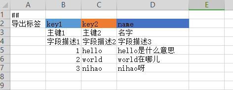

[//]: # "Author: bug"
[//]: # "Date: 2020-10-20 20:24:07"

# Luban

[](https://opensource.org/licenses/MIT)
[](https://travis-ci.com/focus-creative-games/luban)  


-------

## 介绍

Luban是一个强大的对象生成与缓存工具。生成目标可以是类似protobuf的消息代码、游戏配置代码、游戏配置数据、数据库代码，也可以是游戏资源如assetbundle。

Luban适合有以下需求的开发者：
1. 无法容忍传统excel导表工具的简陋功能，希望找一个快速强大经受过上线项目检验的满足中大型游戏项目配置需求的游戏配置解决方案
2. 不想使用protobuf,希望针对项目需求方便地自定义消息生成，满足严苛的内存和性能的要求
3. 希望做其他自定义生成或者缓存

Luban另一优点是生成过程极快。对于普通的导表工作，一个典型的MMORPG项目后期全量生成配置往往需要几十秒。Luban使用client/server的云生成模式，多线程生成+对象缓存，大多数情况下可以1s内完成整个生成过程 ^_^。

------
## 文档

- [主页](https://focus-creative-games.github.io/luban/index.html)
- [特性](docs/traits.md)
- [Excel 配置数据简介](docs/data_excel.md)
- [使用说明](docs/catalog.md)
- [常见问题](docs/faq.md)

------
## 特性
- 支持增强的excel格式，可以在excel里比较简洁填写出任意复杂的数据。
- 支持excel族、json、xml、lua 多种数据格式
- 强大完备的类型系统。支持所有常见原生类型、容器类型list,set,map、枚举和结构、**多态结构**以及**可空类型**
- 灵活的数据源定义。一个表可以来自多个文件，或者一个文件内定义多个表或者一个表对应一个目录下所有文件。以及以上的组合
- 支持表与字段级别分组。可以选择性地导出客户端或者服务器所用的表及字段。
- 多种导出数据格式支持。支持binary、json、lua 等导出数据格式。
- 支持数据标签。 可以选择导出符合要求的数据，发布正式数据时策划不必手动注释掉那些测试或者非正式数据了。
- 强大的数据校验能力。支持内建数据格式检查。支持ref表引用检查（策划不用担心填错id）。支持path资源检查（策划不用担心填错资源路径）。
- 支持 one(单例表)、map（常规key-value表）、bmap(双键表)
- 支持时间本地化。datetime类型数据会根据指定的timezone，转换为目标地区该时刻的UTC时间，方便程序使用。
- [TODO] 支持文本静态本地化。导出时所有text类型数据正确替换为最终的本地化字符串。
- [TODO] 支持文本动态本地化。运行时动态切换所有text类型数据为目标本地化字符串。
- [TODO] 支持main + braches 多分支数据。对于不同地区配置有少量区别的海外项目非常有用。
- 支持 emmylua anntations。生成的lua包含符合emmylua 格式anntations信息。配合emmylua有良好的配置代码提示能力。
- 支持 res 资源标记。可以一键导出配置中引用的所有资源列表(icon,ui,assetbundle等等)
- 生成代码良好模块化。
- 配置数据模块化。策划可以方便地按需求自己组织数据目录和结构，不影响逻辑表。
- 支持主流的游戏开发语言
   - c++ (11+)
   - c# (.net framework 4+. dotnet core 3+)
   - java (1.6+)
   - go (1.10+)
   - lua (5.1+)
   - js 和 typescript (3.0+)
   - python (2.7+ 及 3.0+)
   
- 支持主流引擎和平台
   - unity + c#
   - unity + tolua,xlua
   - unity + ILRuntime
   - unreal + c++
   - unreal + unlua
   - unreal + sluaunreal
   - unreal + puerts
   - cocos2d-x + lua
   - cocos2d-x + js
   - 微信小程序平台
   - 其他家基于js的小程序平台
   - 其他所有支持lua的引擎和平台
   - 其他所有支持js的引擎和平台

--------


## 快速入门 - 结构定义和数据配置

    luban创新性提出 定义+数据源 的概念设计，配合完备的类型系统及多种数据源支持，基本解决了中大弄项目中难以配置复杂数据以及excel、json等多种配置方案不统一的问题。与常见的专注于excel的导表工具把定义和数据放在同一个excel文件的做法不同，luban的定义与数据分离，使用单独的xml定义 **表和结构**。

------
### 常规的原生数据
```
	<bean name="DemoPrimitiveTypesTable">
		<var name="x1" type="bool"/>
		<var name="x2" type="byte"/>
		<var name="x3" type="short"/>
		<var name="x4" type="int?" />
		<var name="x5" type="long" />
		<var name="x6" type="float"/>
		<var name="x7" type="double"/>
		<var name="x10" type="string" />
		<var name="v2" type="vector2"/>
		<var name="v3" type="vector3"/>
		<var name="v4" type="vector4"/>
		<var name="t1" type="datetime"/>
	</bean>
```


------

### 枚举

```
	<enum name="DemoEnum">
		<var name="RED" alias="红" value="1"/>
		<var name="BLUE" alias="蓝" value="3"/>
		<var name="GREEN" alias="绿" value="5"/>
	</enum>
	
	<bean name="DemoEnumTable">
		<var name="id" type="int"/>
		<var name="x2" type="DemoEnum"/>
	</bean>
```


------

### 自定义结构 bean 

```
	<bean name="IntRange">
		<var name="min" type="int"/>
		<var name="max" type="int"/>
	</bean>
	
	<bean name="DemoBeanTable">
		<var name="id" type="int"/>
		<var name="range" type="IntRange"/>
	</bean>
```


------

### 多态结构 bean
```
	<bean name="Shape">
		<var name="id" type="int"/>
		<bean name="Circle">
			<var name="radius" type="float"/>
		</bean>
		<bean name="Rectangle" alias="长方形">
			<var name="width" type="float"/>
			<var name="height" type="float"/>
		</bean>
		<bean name="Curve">
			<bean name="Line" alias="直线">
				<var name="direction" type="vector2"/>
			</bean>
			<bean name="Parabola" alias="抛物线">
				<var name="param_a" type="float"/>
				<var name="param_b" type="float"/>
			</bean>
		</bean>
	</bean>
	
	
	<bean name="ShapeTable">
		<var name="id" type="int"/>
		<var name="shape" type="Shape"/>
	</bean>
```


------

### 可空数据类型
除了string外的所有原生数据类型，以及enum类型都有相应的可空数据类型。定义方式为 <类型名>?，与c#里的Nullable类型定义方式相同。例如 bool?,int?,long?,double?, EColor?

```
	<bean name="NullableTable">
		<var name="id" type="int"/>
		<var name="min_level" type="int?"/>
		<var name="color" type="DemoEnum?"/>
	</bean>
```


------

### 简单列表
```
	<bean name="CollectionTable">
		<var name="id" type="int"/>
		<var name="items" type="list,int"/>
		<var name="coefs" type="list,int"/>
	</bean>
```


### 结构列表
对于结构列表类型，有多种填写。根据策划的偏好，可以自由选择最合适的填法。

- 填法1。 全展开。

```
	<bean name="Item">
		<var name="id" type="int"/>
		<var name="name" type="string"/>
		<var name="num" type="int"/>
	</bean>
	
	<bean name="CollectionTable2">
		<var name="id" type="int"/>
		<var name="items" type="list,Item"/>
	</bean>
```


- 填法2。 每个Item在一个单元格内

```
	<bean name="Item" sep=",">
		<var name="id" type="int"/>
		<var name="name" type="string"/>
		<var name="num" type="int"/>
	</bean>
	
	<bean name="CollectionTable2">
		<var name="id" type="int"/>
		<var name="items" type="list,Item"/>
	</bean>
```


- 填法3。所有数据都在一个单元格内
```
	<bean name="Item" sep=",">
		<var name="id" type="int"/>
		<var name="name" type="string"/>
		<var name="num" type="int"/>
	</bean>
	
	<bean name="CollectionTable2">
		<var name="id" type="int"/>
		<var name="items" type="list,Item" sep="|"/>
	</bean>
```


------
### 多态结构列表
```
	<bean name="CollectionTable3">
		<var name="id" type="int"/>
		<var name="shapes" type="list,Shape" sep=","/>
	</bean>
```

------

### 双主键表
```
	<bean name="TwoKeyTable">
		<var name="key1" type="int"/>
		<var name="key2" type="string"/>
		<var name="name" type="string"/>
	</bean>
	<table name="TbTowKey" value="TwoKeyTable" index="key1,key2" input="examples.xlsx"/>
```


------

### 单例表

单例既代码模式中单例的含义，用于配置全局只有一份的数据。

```
	<bean name="SingletonTable">
		<var name="init_gold_num" type="int"/>
		<var name="guild_module_open_level" type="int"/>
	</bean>
	
	<table name="TbSingleton" value="SingletonTable" mode="one" input="examples.xlsx"/>
```


------


### json 数据源

定义

```
	<bean name="DemoType2" >
		<var name="x4" type="int" convert="DemoEnum"/>
		<var name="x1" type="bool"/>
		<var name="x2" type="byte"/>
		<var name="x3" type="short" ref="test.TbFullTypes"/>
		<var name="x5" type="long" convert="DemoEnum"/>
		<var name="x5" type="long" convert="DemoEnum"/>
		<var name="x6" type="float"/>
		<var name="x7" type="double"/>
		<var name="x8_0" type="fshort"/>
		<var name="x8" type="fint"/>
		<var name="x9" type="flong"/>
		
		<var name="x10" type="string" path="normal;*.txt"/>
		<var name="x12" type="DemoType1"/>
		<var name="x13" type="DemoEnum"/>
		<var name="x14" type="DemoDynamic" sep=","/>多态数据结构
		
		<var name="v2" type="vector2"/>
		<var name="v3" type="vector3"/>
		<var name="v4" type="vector4"/>
		
		<var name="t1" type="datetime"/>

		<var name="k1" type="array,int"/> 使用;来分隔
		
		<var name="k2" type="list,int"/>
		<var name="k3" type="linkedlist,int"/>
		<var name="k4" type="arraylist,int"/>
		<var name="k5" type="set,int"/>
		<var name="k6" type="treeset,int"/>
		<var name="k7" type="hashset,int"/>
		<var name="k8" type="map,int,int"/>
		<var name="k9" type="list,DemoE2" sep="," index="y1"/>
		<var name="k15" type="array,DemoDynamic" sep=","/> 
	</bean>

  <table name="TbDataFromJson" value="DemoType2" input="test/json_datas"/>
```

数据
以目录为数据源，递归遍历整个目录树，将每个json数据当作一个记录读入。


其中 1.json 文件内容如下

```
 {
	"x1":true,
	"x2":3,
	"x3":128,
	"x4":1,
	"x5":11223344,
	"x6":1.2,
	"x7":1.23432,
	"x8_0":12312,
	"x8":112233,
	"x9":223344,
	"x10":"hq",
	"x12": { "x1":10},
	"x13":"B",
	"x14":{"__type__": "DemoD2", "x1":1, "x2":2},
	"v2":{"x":1, "y":2},
	"v3":{"x":1.1, "y":2.2, "z":3.4},
	"v4":{"x":10.1, "y":11.2, "z":12.3, "w":13.4},
	"t1":"1970-01-01 00:00:00",
	"k1":[1,2],
	"k2":[2,3],
	"k3":[1,3],
	"k4":[1,5],
	"k5":[1,6],
	"k6":[1,7],
	"k7":[2,3],
	"k8":[[2,2],[4,10]],
	"k9":[{"y1":1, "y2":true},{"y1":2, "y2":false}],
	"k15":[{"__type__": "DemoD2", "x1":1, "x2":2}]
 }
```
--------
### xml 数据源
定义

```
	<bean name="DemoType2" >
		<var name="x4" type="int" convert="DemoEnum"/>
		<var name="x1" type="bool"/>
		<var name="x2" type="byte"/>
		<var name="x3" type="short" ref="test.TbFullTypes"/>
		<var name="x5" type="long" convert="DemoEnum"/>
		<var name="x5" type="long" convert="DemoEnum"/>
		<var name="x6" type="float"/>
		<var name="x7" type="double"/>
		<var name="x8_0" type="fshort"/>
		<var name="x8" type="fint"/>
		<var name="x9" type="flong"/>
		
		<var name="x10" type="string" path="normal;*.txt"/>
		<var name="x12" type="DemoType1"/>
		<var name="x13" type="DemoEnum"/>
		<var name="x14" type="DemoDynamic" sep=","/>多态数据结构
		
		<var name="v2" type="vector2"/>
		<var name="v3" type="vector3"/>
		<var name="v4" type="vector4"/>
		
		<var name="t1" type="datetime"/>

		<var name="k1" type="array,int"/> 使用;来分隔
		
		<var name="k2" type="list,int"/>
		<var name="k3" type="linkedlist,int"/>
		<var name="k4" type="arraylist,int"/>
		<var name="k5" type="set,int"/>
		<var name="k6" type="treeset,int"/>
		<var name="k7" type="hashset,int"/>
		<var name="k8" type="map,int,int"/>
		<var name="k9" type="list,DemoE2" sep="," index="y1"/>
		<var name="k15" type="array,DemoDynamic" sep=","/> 
	</bean>

<table name="TbDataFromXml" value="DemoType2" input="test/xml_datas"/> 
 	
```

数据

以目录为数据源，递归遍历整个目录树，将每个xml数据当作一个记录读入。
其中 1.xml 文件内容如下
```
 <data>
	<x1>true</x1>
	<x2>4</x2>
	<x3>128</x3>
	<x4>1</x4>
	<x5>112233445566</x5>
	<x6>1.3</x6>
	<x7>1112232.43123</x7>
	<x8>112233</x8>
	<x8_0>123</x8_0>
	<x9>112334</x9>
	<x10>yf</x10>
	<x12>
		<x1>1</x1>
	</x12>
	<x13>C</x13>
	<x14 __type__="DemoD2">
		<x1>1</x1>
		<x2>2</x2>
	</x14>
	<v2>1,2</v2>
	<v3>1.2,2.3,3.4</v3>
	<v4>1.2,2.2,3.2,4.3</v4>
	<t1>1970-01-01 00:00:00</t1>
	<k1>
		<item>1</item>
		<item>2</item>
	</k1>
	<k2>
		<item>1</item>
		<item>2</item>
	</k2>
	<k3>
		<item>1</item>
		<item>2</item>
	</k3>
	<k4>
		<item>1</item>
		<item>2</item>
	</k4>
	<k5>
		<item>1</item>
		<item>2</item>
	</k5>
	<k6>
		<item>1</item>
		<item>2</item>
	</k6>
	<k7>
		<item>1</item>
		<item>3</item>
	</k7>
	<k8>
		<item> <key>2</key><value>10</value></item>
		<item> <key>3</key><value>30</value></item>
	</k8>
	<k9>
		<item>
			<y1>1</y1>
			<y2>true</y2>
		</item>
		<item>
			<y1>2</y1>
			<y2>false</y2>
		</item>
	</k9>
	<k15>
		<item __type__="DemoD2">
			<x1>1</x1>
			<x2>2</x2>
		</item>
	</k15>
</data>
```
### json 数据源

定义

```
	<bean name="DemoType2" >
		<var name="x4" type="int" convert="DemoEnum"/>
		<var name="x1" type="bool"/>
		<var name="x2" type="byte"/>
		<var name="x3" type="short" ref="test.TbFullTypes"/>
		<var name="x5" type="long" convert="DemoEnum"/>
		<var name="x5" type="long" convert="DemoEnum"/>
		<var name="x6" type="float"/>
		<var name="x7" type="double"/>
		<var name="x8_0" type="fshort"/>
		<var name="x8" type="fint"/>
		<var name="x9" type="flong"/>
		
		<var name="x10" type="string" path="normal;*.txt"/>
		<var name="x12" type="DemoType1"/>
		<var name="x13" type="DemoEnum"/>
		<var name="x14" type="DemoDynamic" sep=","/>多态数据结构
		
		<var name="v2" type="vector2"/>
		<var name="v3" type="vector3"/>
		<var name="v4" type="vector4"/>
		
		<var name="t1" type="datetime"/>

		<var name="k1" type="array,int"/> 使用;来分隔
		
		<var name="k2" type="list,int"/>
		<var name="k3" type="linkedlist,int"/>
		<var name="k4" type="arraylist,int"/>
		<var name="k5" type="set,int"/>
		<var name="k6" type="treeset,int"/>
		<var name="k7" type="hashset,int"/>
		<var name="k8" type="map,int,int"/>
		<var name="k9" type="list,DemoE2" sep="," index="y1"/>
		<var name="k15" type="array,DemoDynamic" sep=","/> 
	</bean>

	<table name="TbDataFromLua" value="DemoType2" input="test/lua_datas"/> 
```

数据
以目录为数据源，递归遍历整个目录树，将每个lua数据当作一个记录读入。

其中 1.lua 文件内容如下

```
 return 
{
	x1 = false,
	x2 = 2,
	x3 = 128,
	x4 = 1122,
	x5 = 112233445566,
	x6 = 1.3,
	x7 = 1122,
	x8 = 12,
	x8_0 = 13,
	x9 = 123,
	x10 = "yf",
	x12 = {x1=1},
	x13 = "D",
	x14 = { __type__="DemoD2", x1 = 1, x2=3},
	v2 = {x= 1,y = 2},
	v3 = {x=0.1, y= 0.2,z=0.3},
	v4 = {x=1,y=2,z=3.5,w=4},
	t1 = "1970-01-01 00:00:00",
	k1 = {1,2},
	k2 = {2,3},
	k3 = {3,4},
	k4 = {1,2},
	k5 = {1,3},
	k6 = {1,2},
	k7 = {1,8},
	k8 = {[2]=10,[3]=12},
	k9 = {{y1=1,y2=true}, {y1=10,y2=false}},
	k15 = {{ __type__="DemoD2", x1 = 1, x2=3}},
}
```
------
## 生成代码与数据
以lua为例:

1) 进入 config 目录
2) 双击 生成 lua 数据.bat
3) 生成的 output_lua 目录即对像数据
4) 修改 bat 脚本路径，即可使用至项目中
-----
## 程序使用示例

- Lua 使用示例
  ```Lua
  local data = require("TbItem")
  local cfg = data[32]
  print(cfg.name)
  ```

- C# 使用示例
  ```C#
  // 一行代码可以加载所有配置。 cfg.Tables 包含所有表的一个实例字段。
  var tables = new cfg.Tables(file => return new ByteBuf(File.ReadAllBytes("output_data/" + file)));
  // 访问一个单例表
  Console.WriteLine(tables.TbGlobal.Name);
  // 访问普通的 key-value 表
  Console.WriteLine(tables.TbItem.Get(12).X1);
  // 访问 双键表
  Console.WriteLine(tables.TbTwoKey.Get(1, 10).X8);
  ```
- [更多语言的例子](docs/samples.md)


## 路线图

- [ ] 新增 unity 内置编辑器
- [ ] 新增 unreal 内置编辑器
- [ ] 补充单元测试
- [ ] 支持多国家和地区本地化所需的表 merge 操作

## 开发环境架设

- 安装 [VS2019 社区版](https://visualstudio.microsoft.com/zh-hans/vs/)
- 安装 [.dotnet core sdk 5.0](https://dotnet.microsoft.com/download/dotnet/5.0)

## 如何贡献?

- [Contributing](CONTRIBUTING.md) explains what kinds of changes we welcome
- [Workflow Instructions](docs/workflow/README.md) explains how to build and test

## 有用的链接

- [.NET Core source index](https://source.dot.net)

## 支持和联系

```
  QQ 群: 692890842
  邮箱: taojingjian#gmail.com
```

## License

Luban is licensed under the [MIT](LICENSE.TXT) license.
