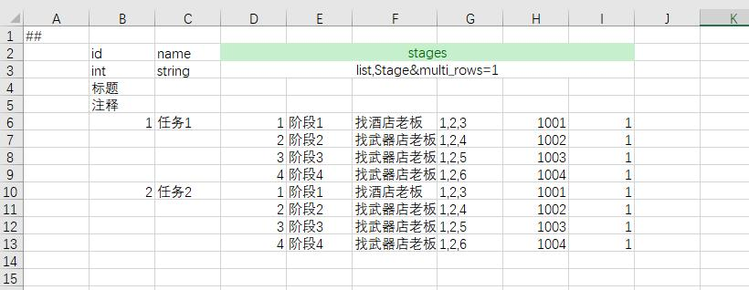

# Luban

[](https://opensource.org/licenses/MIT)
[](https://travis-ci.com/focus-creative-games/luban)  


-----
## links
- [README - English](./README.en-us.md)
- [github link](https://github.com/focus-creative-games/luban)
- [gitee link](https://gitee.com/focus-creative-games/luban)
----

## 介绍

目前已经存在很多导表工具（如tabtoy、xls2json），它们功能多为excel文件到其他格式的转换工具及简单代码生成器，勉强满足中小类型项目的需求。
在中大型游戏项目中，基本都会有技能、行为树之类的复杂功能。这些功能有非常复杂的数据结构，往往使用自定义编辑器制作，并以json、xml等文件格式保存。就算常规的excel表，也经常出现复杂的数据结构需求。这些简单工具面对此类需求要么无法支持，要么就强迫策划和程序使用拆表等奇技淫巧，严重影响开发效率。

luban相较于常规的excel导表工具有以下核心优势：
- 增强了excel格式。可以比较简洁地excel配置**任意复杂**的数据，像子结构、结构列表，以及更复杂的深层次的嵌套结构都能直接解析处理。
- 完备的类型系统和多原始数据支持（xml、json、lua、yaml），可以轻松表达和解析**任意复杂**的数据。意味着传统excel导表工具无法处理的技能、行为树、副本等等复杂配置，luban也能够统一处理了，彻底将程序从复杂的配置解析中完全解放出来。
- 完善的工作流支持。如id的外键引用检查;资源合法性检查;灵活的数据源定义（拆表或者多表合一）;灵活的分组导出机制；多种本地化支持;生成极快（日常迭代300ms以内）等等。

====**如果觉得不错，烦请点个star，你的支持会给予我们巨大动力 ^_^**====

## 文档

- [主页](https://focus-creative-games.github.io/luban/index.html)
- [特性](docs/traits.md)
- [快速上手](docs/install.md)
- [Excel 配置数据简介](docs/data_excel.md)
- [client&server安装与使用说明](docs/luban_install_manual.md)
- [文档目录](docs/catalog.md)
- [[TODO] 完整手册](docs/manual.md)
- **====>强烈推荐查看：示例项目** ([github](https://github.com/focus-creative-games/luban_examples)) ([gitee](https://gitee.com/focus-creative-games/luban_examples)) **<====**

- 支持与联系
  - QQ群: 692890842 （Luban开发交流群）。有使用方面的疑问请及时加QQ群询问，随时有人帮助解决。
  - 邮箱: taojingjian#gmail.com
  - Skypy群: https://join.skype.com/xr2nhdMKjac0

## 特性
- 支持excel族、json、xml、lua、yaml 多种数据格式，基本统一了游戏常见的配置数据
- **强大完备的类型系统**。**可以优雅表达任意复杂的数据结构**。支持所有常见原生类型、datetime类型、容器类型list,set,map、枚举和结构、**多态结构**以及**可空类型**。
- 支持增强的excel格式。可以在excel里比较简洁填写出非常复杂的数据（比如顶层字段包含"list,A"类型字段， 而A是结构并且其中又包含"list,B"类型字段，B也是结构并且包含"list,C"这样的字段...）。
- 生成代码清晰易读、良好模块化。特地支持运行时原子性热更新配置。
- 生成极快。支持常规的本地缓存增量生成模式，也支持云生成模式。MMORPG这样大型项目也能秒内生成。日常增量生成基本在300ms以内，项目后期极大节省了迭代时间。另外支持**watch监测模式**，数据目录变化立即重新生成。
- 灵活的数据源定义。一个表可以来自多个文件或者一个文件内定义多个表或者一个目录下所有文件甚至来自云表格，以及以上的组合
- 支持表与字段级别分组。可以灵活定义分组，选择性地导出客户端或者服务器或编辑器所用的表及字段
- 多种导出数据格式支持。支持binary、json、lua、xml 等导出数据格式
- 强大灵活的定制能力
	- 支持代码模板，可以用自定义模板定制生成的代码格式
	- **支持数据模板**，可以用模板文件定制导出格式。意味着可以在不改动现有程序代码的情况下，把luban当作**配置处理前端**，生成自定义格式的数据与自己项目的配置加载代码配合工作。开发已久的项目或者已经上线的老项目，也能从luban强大的数据处理工作流中获益
- 支持数据标签。 可以选择导出符合要求的数据，发布正式数据时策划不必手动注释掉那些测试数据了
- 强大的数据校验能力。支持内建数据格式检查；支持ref表引用检查（策划不用担心填错id）;支持path资源检查（策划不用担心填错资源路径）;支持range检查
- 支持常量别名。策划不必再为诸如 升级丹 这样的道具手写具体道具id了
- 支持多种常见数据表模式。 one(单例表)、map（常规key-value表）
- 支持res资源标记。可以一键导出配置中引用的所有资源列表(icon,ui,assetbundle等等)
- 统一了自定义编辑器的配置数据。与Unity和UE4的自定义编辑器良好配合，为编辑器生成合适的加载与保存json配置的的c#(Unity)或c++(UE4)代码。保存的json配置能够被luban识别和处理。
- 支持emmylua anntations。生成的lua包含符合emmylua 格式anntations信息。配合emmylua有良好的配置代码提示能力
- **本地化支持**
 	- 支持时间本地化。datetime类型数据会根据指定的timezone，转换为目标地区该时刻的UTC时间，方便程序使用。
	- 支持文本静态本地化。导出时所有text类型数据正确替换为最终的本地化字符串。绝大多数的业务功能不再需要运行根据本地化id去查找文本的内容，简化程序员的工作。
	- 支持文本动态本地化。运行时动态切换所有text类型数据为目标本地化字符串。
	- 支持 main + patches 数据合并。在基础数据上，施加差分数据，生成最终完整数据，适用于制作有细微不同的多地区的配置数据。
	- [TODO] 【独创】 支持任意粒度和任意类型数据（如int,bean,list,map）的本地化。 
- 支持主流的游戏开发语言
   - c++ (11+)
   - c# (.net framework 4+. dotnet core 3+)
   - java (1.6+)
   - go (1.10+)
   - lua (5.1+)
   - js 和 typescript (3.0+)
   - python (3.0+)
   - erlang (18+)
- 支持主流引擎和平台
   - unity + c#
   - unity + [tolua](https://github.com/topameng/tolua)、[xlua](https://github.com/Tencent/xLua)
   - unity + [ILRuntime](https://github.com/Ourpalm/ILRuntime)
   - unity + [puerts](https://github.com/Tencent/puerts)
   - unity + [GameFramework](https://github.com/EllanJiang/GameFramework)
   - unity + [ET游戏框架](https://github.com/egametang/ET)
   - unreal + c++
   - unreal + [unlua](https://github.com/Tencent/UnLua)
   - unreal + [sluaunreal](https://github.com/Tencent/sluaunreal)
   - unreal + [puerts](https://github.com/Tencent/puerts)
   - cocos2d-x + lua
   - cocos2d-x + js
   - [skynet](https://github.com/cloudwu/skynet)
   - 微信小程序平台
   - 其他家基于js的小程序平台
   - 其他所有支持lua的引擎和平台
   - 其他所有支持js的引擎和平台

-----

## 快速上手

以创建一个道具表为例

新建item.xlsx表

 

在__tables__.xlsx里添加一行


假设我们为unity客户端生成c#代码和json数据，命令如下:

```bat
; 请正确设置以下宏的值
; set LUBAN_CLIENT= dotnet %LUBAN_CLIENTSERVER_DIR%/Luban.ClientServer.dll
; set ROOT_DEFINE_FILE=%CONF_ROOT%/Defines/__root__.xml
; set INPUT_DATA_DIR=%CONF_ROOT%/Datas
; set OUTPUT_DATA_DIR=GameData
; set OUTPUT_CODE_DIR=Assets/Gen

%LUBAN_CLIENT% -j cfg --^
 -d %ROOT_DEFINE_FILE% ^
 --input_data_dir %INPUT_DATA_DIR% ^
 --output_code_dir %OUTPUT_CODE_DIR% ^
 --output_data_dir %OUTPUT_DATA_DIR% ^
 --gen_types code_cs_unity_json,data_json ^
 -s all ^
--export_test_data
```
最终在 %OUTPUT_CODE_DIR%目录下生成代码，在%OUTPUT_DATA_DIR%目录下生成数据。生成的数据文件中 item_tbitem.json文件内容如下 (只截取部分)
```json
[
  {
    "id": 10000,
    "name": "发型",
    "desc": "初始发型",
    "price": 100,
    "batch_useable": false
  },
  {
    "id": 10001,
    "name": "外套",
    "desc": "初始外套",
    "price": 100,
    "batch_useable": false
  },
  {
    "id": 10002,
    "name": "上衣",
    "desc": "初始上衣",
    "price": 100,
    "batch_useable": false
  }
]
```

加载及使用配置示例
```c#
// 一行代码可以加载所有配置。 cfg.Tables 包含所有表的一个实例字段。
var tables = new cfg.Tables(file => new ByteBuf(File.ReadAllBytes($"{gameConfDir}/{file}.json")));

// 获得道具配置并且打印
cfg.Item item = tables.TbItem.Get(10001)
Console.WriteLine("name:{0} desc:{1} price:{2}", item.Name, item.Desc, item.Price);

```

## 增强的excel格式
luban支持在excel中解析任意复杂的数据结构，哪怕复杂如技能、行为树（但在实践中一般使用编辑器制作这些数据，以json格式保存，而不会在excel里填写）。下面从简单到复杂展示在luban中配置这些数据的方式。


### 原生数据类型

支持 bool,int,float,string,text,datetime,vector2,vector3,vector4 等等类型，它们的填写跟常规认知一致。


### 原生数据列表

array与list类型都能表示列表，它们区别在于array生成的代码为数组，而list生成代码为列表。例如"array,int"生成的c#代码类型为 int[]，而"list,int"生成的c#代码类型为 List&lt;int&gt;。

下面演示了常见的int与string的列表类型的用法,float与int用法相似。对于这些包含多个元素的数据类型，可以在一个单元格里填写，然后使用sep来分割每个元素；也可以合并标题头的列，表示这个字段占了多个单元格，每个单元格里填一个元素。

由于list,int和list,float是最常见的列表类型，它们数据中也不包含分割符，所以默认对它们使用"sep=,|"，避免填写分割符的麻烦。像list,string由于本身可能包含分割符，所以必须手动指定不与内容冲突的分割符。


### 枚举
游戏往往有枚举的需求，策划填成整数，既不清晰，程序还得手写枚举定义，麻烦又容易不一致。luban支持枚举的定义，强迫策划填写枚举名或者别名，让数据更清楚。

```xml
<enum name="ItemQuality">
	<var name="WHITE" alias="白" value="0"/>
	<var name="GREEN" alias="绿" value="1"/>
	<var name="RED" alias="红" value="2"/>
</enum>
```


### 嵌套子结构
经常会碰到，某个字段是结构，尤其这个结构在很多配置里都会复用。

假设任务中包含一个 任务线索 字段

```xml
<bean name="QuestClue">
	<var name="desc" type="string"/>
	<var name="npc_id" type="int"/>
	<var name="location" type="vector3"/>
</bean>
```


### 简单结构列表
某个字段为结构列表的情形也很常见，比如说奖励信息列表包含多个奖励信息，每个奖励都有多个字段。

假设礼包中包含一个道具信息列表字段。支持3种填写模式，具体选择由策划灵活决定。
- 所有字段完全展开，每个单元格填一个元素。缺点是占用的列较多。如items1字段。
- 每个结构占据一个单元格，使用sep分割结构子字段。如items2字段。
- 整个列表占据一个单元格，使用sep分割列表及结构子字段。如items3字段。

```xml
<bean name="Reward">
	<var name="item_id" type="int"/>
	<var name="count" type="int"/>
	<var name="desc" type="string">
</bean>
```


### 多行结构列表
有时候列表结构的每个结构字段较多，如果水平展开则占据太多列，不方便编辑，如果拆表，无论程序还是策划都不方便。此时可以使用多行填写模式，只需要定义字段属性multi_rows=1。支持任意层次的多行结构列表（也即多行结构中的每个元素也可以是多行）

假设每个任务包含多个阶段，有一个阶段列表字段。

```xml
<bean name="Stage">
	<var name="id" type="int"/>
	<var name="name" type="string"/>
	<var name="desc" type="string"/>
	<var name="location" type="vector3"/>
	<var name="reward_item_id" type="int"/>
	<var name="reward_item_count" type="int"/>
</bean>
```




### 单例表
有一些配置全局只有一份，比如 公会模块的开启等级，背包初始大小，背包上限。此时使用单例表来配置这些数据比较合适。


### 纵表

大多数表都是横表，即一行一个记录。有些表，比如单例表，如果纵着填，一行一个字段，会比较舒服。meta行添加 orientation=c 则使用纵表模式来填写内容。 上面的单例表，以纵表模式填如下。


### 引用检查
游戏配置中经常要填写诸如道具id之类的外键数据，这些数据必须是合法的id值。编辑数据过程中容易失误填了非法id或者因为配置变更导致指向的记录已经被删除了。luban支持生成时检查id的合法性，如果有误，则打出警告（不中止生成，因为开发中临时存在未修正的配置是常见现象， 不希望阻断开发工作流程）。

只要字段定义中添加 ref="表全名" 即可。不只是表顶层字段，列表及嵌套结构的子字段也支持完整的引用检查。

```xml
<bean name="Reward">
	<var name="item_id" type="int" ref="item.TbItem"/>
	<var name="count" type="int"/>
	<var name="desc" type="string">
</bean>
```


### 资源检查
配置中经常要填写资源路径，比如道具icon的资源，这些数据都是string类型，非常容易填写出错，导致运行时无法正常显示。luban支持unity与ue4资源的合法性检查以及通用型文件路径检查。不只是表顶层字段，列表及嵌套结构的子字段也支持完整的引用检查。

对于这些字段添加属性 path=unity或者path=ue或path=normal;xxxx。


### 分组导出

在大多数项目中，导出给前后端的数据并非完全相同。有些表可能仅仅前端或者后端需要，有些字段也可能仅仅前端或者后端需要。 luban同时支持两种级别的分组：
#### 表级别分组

定义方式为在table中定义group属性，如果未定义 group,则默认导出给所有分组，如果定义group，则只导出给指定分组，可以多个，以逗号","分隔。

例如: TbDemoGroup_C表只给客户端使用, TbDemoGroup_S只能服务器使用, TbDemoGroup_E只给editor使用。
定义如下:


#### 字段级别分组

定义方式为给var指定group属性，未指定则默认导出给所有分组。可以为多个，以逗号","分隔。相比于大多数导表工具只支持**表顶级字段**的分组导出，luban支持任意bean字段粒度级别的分组导出。

例如, TbDemoGroup表中 id,x1,x4 字段前后端都需要; x3 只有后端需要;x2 字段只有前端需要。x5是bean类型，它导出给前后端，但它的子字段也可以被分组过滤， x5.y1, x2.y4前后端都会导出，x5.x3只导出给后端,x5.x2只导出给前端。
定义如下:


### 字段默认值
我们希望excel中单元格留空时，该字段取指定值，而不是默认的false,0之类。通过定义字段的default=xxx属性来指定默认值。

如示例，id=2的记录，x1与x2皆为空，x1=0,x2=-1。


### 数据标签

开发期有时候希望临时注释掉一些记录，另外开发期经常会制作一些仅供开发使用的配置，比如测试道具，比如自动化测试使用的配置，在正式上线时不导出这些数据。 luban支持数据标签及数据注释及测试数据过滤导出，导出正式配置时不需要手动将测试数据删掉。


## 高级特性
### 层级标题头 (hierarchy title)
在多行数据或者深层次嵌套的数据中，如果数据字段较多，填写时不易区分子元素。luban提供层级标题实现深层次的子字段对应。以上面的多行数据列表为例。


### 可空数据类型
配置数据中经常有空值的语义需求，实际项目中往往混杂地使用0或-1表达空值，既不自然清晰也不统一。luban借鉴了c#中的可空变量的概念，特地提供可空数据支持。所有原生数据类型，以及enum、bean、和多态bean类型都有相应的可空数据类型。定义方式为 <类型名>?，与c#里的Nullable类型定义方式相同。例如 bool?,int?,long?,double?, EColor?, DemoType?


### 类型继承(inheritance)
支持OOP的类型继承体系，方便表达多类型的数据，常用于技能、AI等模块。类型继承是luban类型系统的灵魂，如果没有类型继承，不可能简洁地表达任意复杂数据结构，因而也不可能定义并且从配置中读取复杂的配置数据。

实践中像技能和AI之类的数据，一般用编辑器制作，使用json之类的格式保存，而不是在excel中编辑。

```xml
<bean name="Shape">
	<bean name="Circle">
		<var name="radius" type="float"/>
	</bean>
	<bean name="Rectangle" alias="长方形">
		<var name="width" type="float"/>
		<var name="height" type="float"/>
	</bean>
	<bean name="Curve">
		<bean name="Line" alias="直线">
			<var name="param_a" type="float"/>
			<var name="param_b" type="float"/>
		</bean>
		<bean name="Parabola" alias="抛物线">
			<var name="param_a" type="float"/>
			<var name="param_b" type="float"/>
		</bean>
	</bean>
</bean>

```


### 常量别名

游戏里经常会出现一些常用的类似枚举的值，比如说 升级丹的 id,在很多地方都要填，如果直接它的道具 id,既不直观，也容易出错。 Luban 支持常量替换。对于需要常量替换的字段，添加 convert=”枚举类”。 如果填写的值是 枚举名或者别名，则替换为 相应的整数。否则 按照整数解析。

``` xml
<enum name="EFunctionItemId">
	<var name="SHENG_JI_DAN" alias="升级丹" value="11220304"/>
	<var name="JIN_JIE_DAN" alias="进阶丹" value="11220506"/>
</enum>
```


导出时，升级丹会被替换为11220304。

### 多数据源
支持表数据来自excel文件；来自excel某个单元薄；来自json、xml、yaml文件；来自目录下所有文件。以及以上几种的组合。
#### 来自某个excel文件
```xml
<table name="TbItem" value="Item" input="item/item1.xlsx">
```
#### 来自某个excel单元薄
```xml
<table name="TbItem" value="Item" input="table1@item/item1.xlsx">
```
####
#### 一个数据表来自两个excel文件
通过 excel文件1,excel文件2... 的方式指定数据表的数据来自多个文件，不同文件以逗号","分隔。当数据源为excel文件，并且没有用@来指定某个单元表时，该excel文件的中的所有单元表都会被读入。例如TbItem表的数据来自item目录下的item1.xlsx和item2.xlsx。
	
```xml
<table name="TbItem" value="Item" input="item/item1.xlsx,item/item2.xlsx">
```

#### 两个数据表来自同一个excel文件的不同单元表
通过 <单元表名>@excel文件的方式指定数据来自excel文件的某个单元表，可以指定多个单元表，通过逗号","分隔。示例中TbItem占了table1、table3两个单元表；TbEquip占了table2、table4两个单元表。同一个数据表占据的单元表不必连续。示例中故意让TbItem和TbEquip占了不相邻的两个单元表。

```xml
<table name="TbItem" value="Item" input="table1@examples.xlsx,table3@examples.xlsx">
<table name="TbEquip" value="Equip" input="table2@examples.xlsx,table4@examples.xlsx">
```

#### 一个数据表的数据来自**目录**下的所有文件
当以目录为数据源时，会遍历整个目录树中所有文件，除了文件名以 ",.~"（字符逗号或点号或波浪号）开头的文件外，读入每个文件中的数据。如果是excel族的数据，会从每个文件中读取多个记录，如果是xml、lua、json族的数据，每个文件当作一个记录读入。 可以有指定多个目录同时为数据源，以逗号","分隔。
```xml
<table name="TbSkill" value="Skill" input="skill_datas">
```

### json 数据源
在一个大型复杂项目里，有些表的数据是以json形式保存，比如技能、AI、剧情等等。常规的导表工具只能处理excel，像xml、json之类的数据一般是程序员自己处理，最终导致游戏内有几套配置加载方案，而且前后端以及
编辑器的开发者还得花费大量时间手写代码去处理这些数据，既麻烦又不容易定位错误。

luban通过 **定义 + 数据源** 的方式统一所有配置。json数据源用法与excel数据源基本相同，唯一区别在于
输入的数据文件格式由xlsx变成json。实际项目中如果以json为数据格式，为了方便编辑器处理，一般一个记录占一个文件，所有记录统一放在一个目录下，因此数据源变成了目录。如下图中的input="test/json_datas"目录。

```xml
<bean name="DemoType2" >
	<var name="x4" type="int" convert="DemoEnum"/>
	<var name="x1" type="bool"/>
	<var name="x5" type="long" convert="DemoEnum"/>
	<var name="x6" type="float"/>
	<var name="x7" type="double"/>
	<var name="x10" type="string"/>
	<var name="x12" type="DemoType1"/>
	<var name="x13" type="DemoEnum"/>
	<var name="x14" type="DemoDynamic" sep=","/>多态数据结构
	<var name="v2" type="vector2"/>
	<var name="v3" type="vector3"/>
	<var name="v4" type="vector4"/>
	<var name="t1" type="datetime"/>
	<var name="k1" type="array,int"/> 使用;来分隔
	<var name="k2" type="list,int"/>
	<var name="k8" type="map,int,int"/>
	<var name="k9" type="list,DemoE2" sep="," index="y1"/>
	<var name="k15" type="array,DemoDynamic" sep=","/> 
</bean>

<table name="TbDataFromJson" value="DemoType2" input="test/json_datas"/>
```

递归遍历test/json_datas整个目录树，**按文件名排序后**依次将每个json数据当作一个记录读入。其中1.json文件内容如下

```json
 {
	"x1":true,
	"x2":3,
	"x3":128,
	"x4":1,
	"x5":11223344,
	"x6":1.2,
	"x7":1.23432,
	"x10":"hq",
	"x12": { "x1":10},
	"x13":"B",
	"x14":{"__type__": "DemoD2", "x1":1, "x2":2},
	"v2":{"x":1, "y":2},
	"v3":{"x":1.1, "y":2.2, "z":3.4},
	"v4":{"x":10.1, "y":11.2, "z":12.3, "w":13.4},
	"t1":"1970-01-01 00:00:00",
	"k1":[1,2],
	"k2":[2,3],
	"k7":[2,3],
	"k8":[[2,2],[4,10]],
	"k9":[{"y1":1, "y2":true},{"y1":2, "y2":false}],
	"k15":[{"__type__": "DemoD2", "x1":1, "x2":2}]
 }
```

### xml 数据源

```xml
<table name="TbDataFromXml" value="DemoType2" input="test/xml_datas"/> 
```

其中 1.xml 文件内容如下
```xml
 <data>
	<x1>true</x1>
	<x2>4</x2>
	<x3>128</x3>
	<x4>1</x4>
	<x5>112233445566</x5>
	<x6>1.3</x6>
	<x7>1112232.43123</x7>
	<x10>yf</x10>
	<x12>		<x1>1</x1>	</x12>
	<x13>C</x13>
	<x14 __type__="DemoD2">		<x1>1</x1>		<x2>2</x2>	</x14>
	<v2>1,2</v2>
	<v3>1.2,2.3,3.4</v3>
	<v4>1.2,2.2,3.2,4.3</v4>
	<t1>1970-01-01 00:00:00</t1>
	<k1>    <item>1</item>	<item>2</item>	</k1>
	<k2>	<item>1</item>	<item>2</item>	</k2>
	<k8>
		<item> <key>2</key><value>10</value></item>
		<item> <key>3</key><value>30</value></item>
	</k8>
	<k9>
		<item>	<y1>1</y1>	<y2>true</y2>	</item>
		<item>	<y1>2</y1>	<y2>false</y2>	</item>
	</k9>
	<k15>
		<item __type__="DemoD2">	<x1>1</x1>	<x2>2</x2>	</item>
	</k15>
</data>
```
### lua 数据源

```xml
<table name="TbDataFromLua" value="DemoType2" input="test/lua_datas"/> 
```
其中 1.lua 文件内容如下
```lua
return 
{
	x1 = false,
	x2 = 2,
	x3 = 128,
	x4 = 1122,
	x5 = 112233445566,
	x6 = 1.3,
	x7 = 1122,
	x10 = "yf",
	x12 = {x1=1},
	x13 = "D",
	x14 = { __type__="DemoD2", x1 = 1, x2=3},
	v2 = {x= 1,y = 2},
	v3 = {x=0.1, y= 0.2,z=0.3},
	v4 = {x=1,y=2,z=3.5,w=4},
	t1 = "1970-01-01 00:00:00",
	k1 = {1,2},
	k2 = {2,3},
	k8 = {[2]=10,[3]=12},
	k9 = {{y1=1,y2=true}, {y1=10,y2=false}},
	k15 = {{ __type__="DemoD2", x1 = 1, x2=3}},
}
```

### yaml 数据源

```xml
<table name="TbDataFromYaml" value="DemoType2" input="test/yaml_datas"/> 
```
其中 1.yml 文件内容如下
```yaml
---
x1: true
x2: 3
x3: 128
x4: 40
x5: 11223344
x6: 1.2
x7: 1.23432
x10: hq
x12:
  x1: 10
x13: B
x14:
  __type__: DemoD2
  x1: 1
  x2: 2
s1:
  key: "/key32"
  text: aabbcc22
v2:
  x: 1
  y: 2
v3:
  x: 1.1
  y: 2.2
  z: 3.4
v4:
  x: 10.1
  y: 11.2
  z: 12.3
  w: 13.4
t1: '1970-01-01 00:00:00'
k1:
- 1
- 2
k2:
- 2
- 3
k8:
- - 2
  - 2
- - 4
  - 10
k9:
- y1: 1
  y2: true
- y1: 2
  y2: false
k15:
- __type__: DemoD2
  x1: 1
  x2: 2

```

### binary,json,lua 导出数据格式
支持binary,json,lua三种导出数据类型。不同的导出类型只影响导出的数据大小和生成的代码和加载数据的性能，不影响结构定义以及最终加载到内存占用。

不同的导出数据类型对程序和策划是透明的，切换不影响数据编辑方式和业务代码中使用配置的方式。

### 代码模板

使用scriban模板文件定制导出数据格式。例如生成cs语言bin数据格式的cfg.Tables类的模板如下。

```
using Bright.Serialization;

{{
    name = x.name
    namespace = x.namespace
    tables = x.tables
}}
namespace {{namespace}}
{
   
public sealed class {{name}}
{
    {{~for table in tables ~}}
{{~if table.comment != '' ~}}
    /// <summary>
    /// {{table.comment}}
    /// </summary>
{{~end~}}
    public {{table.full_name}} {{table.name}} {get; }
    {{~end~}}

    public {{name}}(System.Func<string, ByteBuf> loader)
    {
        var tables = new System.Collections.Generic.Dictionary<string, object>();
        {{~for table in tables ~}}
        {{table.name}} = new {{table.full_name}}(loader("{{table.output_data_file}}")); 
        tables.Add("{{table.full_name}}", {{table.name}});
        {{~end~}}

        {{~for table in tables ~}}
        {{table.name}}.Resolve(tables); 
        {{~end~}}
    }

    public void TranslateText(System.Func<string, string, string> translator)
    {
        {{~for table in tables ~}}
        {{table.name}}.TranslateText(translator); 
        {{~end~}}
    }
}

}
```

### 数据模板
使用scriban模板文件定制导出数据格式。例如自定义的lua数据模板如下：

```
// {{table.name}}
{{for d in datas}}
	// {{d.impl_type.full_name}}
	{{~i = 0~}}
	{{~for f in d.fields~}}
		{{~if f ~}}
		// {{d.impl_type.hierarchy_export_fields[i].name}} = {{f.value}}
		{{~end~}}
		{{~i = i + 1~}}
	{{~end~}}
{{end}}
```

输出数据

```
// TbItem
	// item.Item
		// id = 1
		// name = 钻石
		// major_type = 1
		// minor_type = 101
		// max_pile_num = 9999999
		// quality = 0
		// icon = /Game/UI/UIText/UI_TestIcon_3.UI_TestIcon_3
		
	// item.Item
		// id = 2
		// name = 金币
		// major_type = 1
		// minor_type = 102
		// max_pile_num = 9999999
		// quality = 0
		// icon = /Game/UI/UIText/UI_TestIcon_1.UI_TestIcon_1
```

## 本地化

### 静态本地化

单独提供了text类型来支持文本的本地化。 text类型由两个字段构成, key和value。 考虑到大多数项目是优先做了主地区配置后，再进行本地化，因此luban特地支持在配置中原地填写text的key和主地区文本值。制作其他地区配置时，通过指定本地化映射表的方式，再将该text转换为目标语言的文本值。


主语言导出数据为 (只截取了部分数据)

```json
[
  {
    "id": 11,
    "text": {
      "key": "/demo/1",
      "text": "测试1"
    }
  },
  {
    "id": 12,
    "text": {
      "key": "/demo/2",
      "text": "测试2"
    }
  },
  {
    "id": 13,
    "text": {
      "key": "/demo/3",
      "text": "测试3"
    }
  }
]
```

制作本地化映射表 


映射到英语后的导出数据（只截取了部分数据）为
```json
[
  {
    "id": 11,
    "text": {
      "key": "/demo/1",
      "text": "test1"
    }
  },
  {
    "id": 12,
    "text": {
      "key": "/demo/2",
      "text": "test2"
    }
  },
  {
    "id": 13,
    "text": {
      "key": "/demo/3",
      "text": "test3"
    }
  }
]
```

### 动态本地化
运行时动态切换语言到目标语言。

生成的cfg.Tables包含TranslateText函数， 以c#为例。只需要提供一个 (string key, string origin_value) -> (string target_value) 的转换器，
就能自动将所有配置表中的text类型字段替换为目标语言的文本。程序不需要根据id去本地化映射表里查询，简化了使用。

```c#
public void TranslateText(System.Func<string, string, string> translator)
{
	TbItem.TranslateText(translator);
	...
}
```

### 多分支 数据
支持 main + patches的数据模式。在主版本数据基础上，提供一个补丁数据，合并处理后生成最终目标数据。适合制作海外有细节配置不同的多地区配置，不需要
复制出主版本数据，接着在上面修改出最终数据。极大优化了制作本地化配置的工作流。


### 时间本地化
datetime类型数据在指定了本地化时区后，会根据目标时区，生成相应时刻的UTC时间，方便程序使用

###
-----

## 路线图

- [ ] 新增 unity 内置编辑器
- [ ] 新增 unreal 内置编辑器
- [ ] 补充单元测试

## 开发环境架设

- 安装 [VS2019 社区版](https://visualstudio.microsoft.com/zh-hans/vs/)
- 安装 [.dotnet core sdk 5.0](https://dotnet.microsoft.com/download/dotnet/5.0)

## 安装与使用

参见 [client&server安装与使用说明](docs/luban_install_manual.md)

## 如何贡献

- [Contributing](CONTRIBUTING.md) explains what kinds of changes we welcome
- [Workflow Instructions](docs/workflow/README.md) explains how to build and test

## 有用的链接

- [.NET Core source index](https://source.dot.net)

## License

Luban is licensed under the [MIT](LICENSE.TXT) license.
