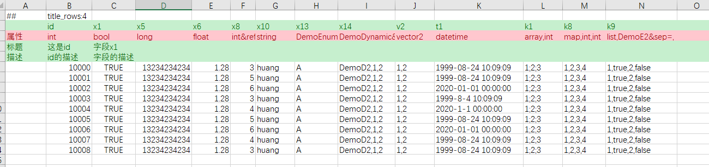
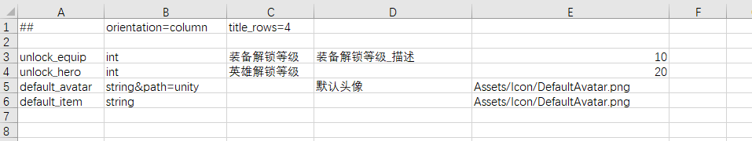
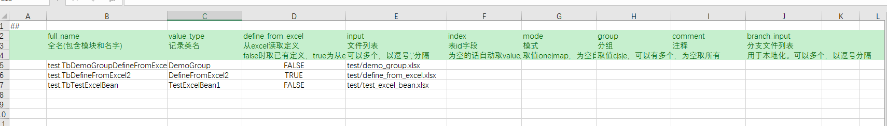
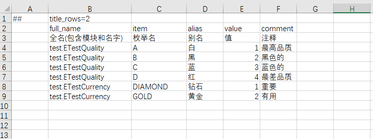
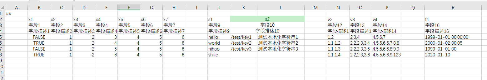

# Luban

[](https://opensource.org/licenses/MIT)
[](https://travis-ci.com/focus-creative-games/luban)  


-----
## links
- [README - English](./README.en-us.md)
- [github link](https://github.com/focus-creative-games/luban)
- [gitee link](https://gitee.com/focus-creative-games/luban)
----

## 介绍

luban是[BrightDB](https://github.com/focus-creative-games/BrightDB)的附属项目，一个通用型对象生成与缓存工具, 在此基础上实现了一个功能**完备强大灵活易用**的**游戏配置解决方案**。

luban基于 **meta定义 + 数据源** 的设计，实现了**完备的类型系统**，增强了excel格式，同时提供json、xml、lua、yaml等丰富的数据源支持。既可以处理常规的简单配置，也能完美处理**AI、技能、副本**等复杂配置，真正实现了统一数据定义、加载、检验、数据导出及代码生成的游戏配置工作流。比较好解决了中大型项目中策划难以实时检查复杂配置错误而与程序反复迭代编辑的问题，以及复杂的AI、技能等配置数据无法与excel配置统一，需要程序员单独处理的问题。

**luban功能较为完善，支持游戏行业几乎所有主流的前后端语言和客户端引擎**。luban目前由专业团队维护，保持活跃的特性更新及功能优化，并有研发人员及时提供开发指导和跟进反馈。

Luban适合有以下需求的开发者：
- 希望找一个功能完备经受过上线项目检验的满足**中大型**游戏项目配置需求的游戏配置解决方案
- 希望有较完善的工作流，有效提高策划与程序的开发效率
- 希望针对项目需求方便地定制配置、消息等生成，满足更严苛的内存和性能的要求
- 希望做其他自定义生成或者缓存

====**如果觉得不错，烦请点个star，你的支持会给予我们巨大动力 ^_^**====

## 文档

- [主页](https://focus-creative-games.github.io/luban/index.html)
- [特性](docs/traits.md)
- [快速上手](docs/install.md)
- [Excel 配置数据简介](docs/data_excel.md)
- [client&server安装与使用说明](docs/luban_install_manual.md)
- [文档目录](docs/catalog.md)
- [[TODO] 完整手册](docs/manual.md)
- **====>强烈推荐查看：示例项目** ([github](https://github.com/focus-creative-games/luban_examples)) ([gitee](https://gitee.com/focus-creative-games/luban_examples)) **<====**

- 支持与联系
  - QQ群: 692890842 （Luban开发交流群） [点击链接加入](https://qm.qq.com/cgi-bin/qm/qr?k=4bMoe11knBW7Tcs1sqMafZE1I4zpT4sh&jump_from=webapi)。 有使用方面的疑问请及时加QQ群询问，随时有人帮助解决。
  - 邮箱: taojingjian#gmail.com
  - Skypy群: https://join.skype.com/xr2nhdMKjac0


-----

## 特性
- 支持excel族、json、xml、lua、yaml 多种数据格式，基本统一了游戏常见的配置数据
- **强大完备的类型系统**。**可以优雅表达任意复杂的数据结构**。支持所有常见原生类型、datetime类型、容器类型list,set,map、枚举和结构、**多态结构**以及**可空类型**。
- 支持增强的excel格式。可以在excel里比较简洁填写出非常复杂的数据（比如顶层字段包含"list,A"类型字段， 而A是结构并且其中又包含"list,B"类型字段，B也是结构并且包含"list,C"这样的字段...）。
- 生成代码清晰易读、良好模块化。特地支持运行时原子性热更新配置。
- 生成极快。支持常规的本地缓存增量生成模式，也支持云生成模式。MMORPG这样大型项目也能秒内生成。日常增量生成基本在300ms以内，项目后期极大节省了迭代时间。另外支持**watch监测模式**，数据目录变化立即重新生成。
- 灵活的数据源定义。一个表可以来自多个文件或者一个文件内定义多个表或者一个目录下所有文件甚至来自云表格，以及以上的组合
- 支持表与字段级别分组。可以选择性地导出客户端或者服务器所用的表及字段
- 多种导出数据格式支持。支持binary、json、lua、xml、erlang 等导出数据格式
- 强大灵活的定制能力
	- 支持代码模板，可以用自定义模板定制生成的代码格式
	- **支持数据模板**，可以用模板文件定制导出格式。意味着可以在不改动现有程序代码的情况下，把luban当作**配置处理前端**，生成自定义格式的数据与自己项目的配置加载代码配合工作。开发已久的项目或者已经上线的老项目，也能从luban强大的数据处理工作流中获益
- 支持数据标签。 可以选择导出符合要求的数据，发布正式数据时策划不必手动注释掉那些测试数据了
- 强大的数据校验能力。支持内建数据格式检查；支持ref表引用检查（策划不用担心填错id）;支持path资源检查（策划不用担心填错资源路径）;支持range检查
- 支持常量别名。策划不必再为诸如 升级丹 这样的道具手写具体道具id了
- 支持多种常见数据表模式。 one(单例表)、map（常规key-value表）
- 支持res资源标记。可以一键导出配置中引用的所有资源列表(icon,ui,assetbundle等等)
- 统一了自定义编辑器的配置数据。与Unity和UE4的自定义编辑器良好配合，为编辑器生成合适的加载与保存json配置的的c#(Unity)或c++(UE4)代码。保存的json配置能够被luban识别和处理。
- 支持emmylua anntations。生成的lua包含符合emmylua 格式anntations信息。配合emmylua有良好的配置代码提示能力
- **本地化支持**
 	- 支持时间本地化。datetime类型数据会根据指定的timezone，转换为目标地区该时刻的UTC时间，方便程序使用。
	- 支持文本静态本地化。导出时所有text类型数据正确替换为最终的本地化字符串。绝大多数的业务功能不再需要运行根据本地化id去查找文本的内容，简化程序员的工作。
	- 支持文本动态本地化。运行时动态切换所有text类型数据为目标本地化字符串。
	- 支持 main + patches 数据合并。在基础数据上，施加差分数据，生成最终完整数据，适用于制作有细微不同的多地区的配置数据。
	- [TODO] 【独创】 支持任意粒度和任意类型数据（如int,bean,list,map）的本地化。 
- 支持主流的游戏开发语言
   - c++ (11+)
   - c# (.net framework 4+. dotnet core 3+)
   - java (1.6+)
   - go (1.10+)
   - lua (5.1+)
   - js 和 typescript (3.0+)
   - python (3.0+)
   - erlang (18+)
- 支持主流引擎和平台
   - unity + c#
   - unity + [tolua](https://github.com/topameng/tolua)、[xlua](https://github.com/Tencent/xLua)
   - unity + [ILRuntime](https://github.com/Ourpalm/ILRuntime)
   - unity + [puerts](https://github.com/Tencent/puerts)
   - unity + [GameFramework](https://github.com/EllanJiang/GameFramework)
   - unity + [ET游戏框架](https://github.com/egametang/ET)
   - unreal + c++
   - unreal + [unlua](https://github.com/Tencent/UnLua)
   - unreal + [sluaunreal](https://github.com/Tencent/sluaunreal)
   - unreal + [puerts](https://github.com/Tencent/puerts)
   - cocos2d-x + lua
   - cocos2d-x + js
   - [skynet](https://github.com/cloudwu/skynet)
   - 微信小程序平台
   - 其他家基于js的小程序平台
   - 其他所有支持lua的引擎和平台
   - 其他所有支持js的引擎和平台

-----

## luban工作流程Pipeline

<br/>
<br/>


<br/>
<br/>

-------
## benchmark 性能测试结果

硬件：Intel(R) Core i7-10700 @ 2.9G 16核，32G 内存

数据集：500个excel表，每个表有1000行的记录，记录较为复杂

测试结果：

| 格式 | 全量生成耗时 | 增量生成耗时 | 单个输出文件大小 | 输出文件总大小 |
| ---- | --------| ------  | ----            | ------ |
| bin  | 15.652 s| 797 ms  | 164 K            | 59.5 M |
| json | 17.746 s| 796 ms  | 1.11 M           | 555 M   |
| lua  | 17.323 s| 739 ms  | 433 K           | 212 M   |


<br/>

-----
## 代码快速预览


这儿只简略展示lua、c#、typescript、go语言在开发中的用法，更多语言以及更详细的使用范例和代码见[示例项目](https://github.com/focus-creative-games/luban_examples)。


- C# 使用示例

```C#
// 一行代码可以加载所有配置。 cfg.Tables 包含所有表的一个实例字段。
var tables = new cfg.Tables(file => return new ByteBuf(File.ReadAllBytes(gameConfDir + "/" + file)));
// 访问一个单例表
Console.WriteLine(tables.TbGlobal.Name);
// 访问普通的 key-value 表
Console.WriteLine(tables.TbItem.Get(12).X1);
// 支持 operator []用法
Console.WriteLine(tables.TbMail[1001].X2);
```

- typescript 使用示例

```typescript
// 一行代码可以加载所有配置。 cfg.Tables 包含所有表的一个实例字段。
let tables = new cfg.Tables(f => JsHelpers.LoadFromFile(gameConfDir, f))
// 访问一个单例表
console.log(tables.TbGlobal.name)
// 访问普通的 key-value 表
console.log(tables.TbItem.get(12).x1)
```

- go 使用示例
```go
// 一行代码可以加载所有配置。 cfg.Tables 包含所有表的一个实例字段。
if tables , err := cfg.NewTables(loader) ; err != nil {
	println(err.Error())
	return
}
// 访问一个单例表
println(tables.TbGlobal.Name)
// 访问普通的 key-value 表
println(tables.TbItem.Get(12).X1)

```

- Lua 使用示例

```Lua
-- 访问一个单例表
print(require("TbGlobal").name)
-- 访问普通的 key-value 表
print(require("TbItem")[12].x1)
```

------

## 配置快速预览

**luban兼容传统的excel导表工具，可以在excel定义完整的数据表**。与常见的专注于excel的导表工具不同，luban推荐做法为定义与数据分离，使用单独的xml定义 **表和结构**，数据文件只包含数据。

### 传统兼容横表

<br/>



### 轻松表达传统导表工具难以支持的复杂配置

<br/>


### 传统兼容纵表

<br/>

 

### excel中添加table声明
<br/>

 

### 在excel中定义enum 类型

<br/>



### 在excel中定义bean 类型

<br/>


<br/>

### 常规的原生数据 （虽然示例中这些表都在xml中定义，实际上它们可以完全只在excel定义）

以下是一个包含所有常见简单原生数据的表。

```xml
<bean name="DemoPrimitiveTypesTable">
	<var name="x1" type="bool"/>
	<var name="x2" type="byte"/>
	<var name="x3" type="short"/>
	<var name="x4" type="int" />
	<var name="x5" type="long" />
	<var name="x6" type="float"/>
	<var name="x7" type="double"/>
	<var name="s1" type="string" />
	<var name="s2" type="text"/> 本地化字符串,由key和text两个字段构成
	<var name="v2" type="vector2"/>
	<var name="v3" type="vector3"/>
	<var name="v4" type="vector4"/>
	<var name="t1" type="datetime"/>
</bean>

<table name="TbDemoPrimitive" index="x4" value="DemoPrimitiveTypesTable" input="demo_primitive.xlsx"/>
```




- name="TbDemoPrimitive" 表示数据表名为TbDemoPrimitive，生成table的代码时使用这个类名。
- value="DemoPrimitiveTypesTable" 表示数据表每行记录(即KV中的V)的类型为DemoPrimitiveTypesTable。
- index="x4" 表示数据表以 <value>类型的x4字段为key。可不填，**默认为第一个字段**。
- input="demo_primitive.xlsx" 表示数据表的数据文件为 demo_primitives.xlsx

### 枚举

定义枚举类，同时强制配置中必须填写枚举名或者别名，提高配置阅读性。

```xml
<enum name="DemoEnum">
	<var name="RED" alias="红" value="1"/>
	<var name="BLUE" alias="蓝" value="3"/>
	<var name="GREEN" alias="绿" value="5"/>
</enum>

<bean name="DemoEnumTable">
	<var name="id" type="int"/>
	<var name="x2" type="DemoEnum"/>
</bean>

<table name="TbDemoEnum" value="DemoEnumTable" input="demo_enum.xlsx"/>
```


### 自定义结构 bean 

```xml
<bean name="IntRange">
	<var name="min" type="int"/>
	<var name="max" type="int"/>
</bean>

<bean name="DemoBeanTable">
	<var name="id" type="int"/>
	<var name="range" type="IntRange"/>
</bean>

<table name="TbDemoBean" value="DemoBeanTable" input="demo_bean.xlsx"/>
```


### 多态结构 bean
支持OOP的类型的继承体系，方便表达多类型的数据，经常用于技能、AI等模块。

```xml
<bean name="Shape">
	<var name="id" type="int"/>
	<bean name="Circle">
		<var name="radius" type="float"/>
	</bean>
	<bean name="Rectangle" alias="长方形">
		<var name="width" type="float"/>
		<var name="height" type="float"/>
	</bean>
	<bean name="Curve">
		<bean name="Line" alias="直线">
			<var name="direction" type="vector2"/>
		</bean>
		<bean name="Parabola" alias="抛物线">
			<var name="param_a" type="float"/>
			<var name="param_b" type="float"/>
		</bean>
	</bean>
</bean>

<bean name="ShapeTable">
	<var name="id" type="int"/>
	<var name="shape" type="Shape"/>
</bean>

<table name="TbDemoShape" value="DemoShapeTable" input="demo_shape.xlsx"/>
```


### 可空数据类型
配置数据中经常有空值的语义需求，实际项目中往往混杂地使用0或-1表达空值，既不自然清晰也不统一。luban借鉴了c#中的可空变量的概念，特地提供可空数据支持。所有原生数据类型，以及enum、bean、和多态bean类型都有相应的可空数据类型。定义方式为 <类型名>?，与c#里的Nullable类型定义方式相同。例如 bool?,int?,long?,double?, EColor?, DemoType?

```xml
	<bean name="DemoType1">
		<var name="x1" type="int"/>
	</bean>
	<bean name="DemoDynamic"> 多态数据结构
		<var name="x1" type="int"/>
		
		<bean name="DemoD2" alias="测试别名">
			<var name="x2" type="int"/>
		</bean>
		
		<bean name="DemoD3">
			<var name="x3" type="int"/>
		</bean>
	</bean>
	<bean name="TestNull">
		<var name="id" type="int"/>
		<var name="x1" type="int?"/>
		<var name="x2" type="DemoEnum?"/>
		<var name="x3" type="DemoType1?"/>
		<var name="x4" type="DemoDynamic?"/>
	</bean>
	<table name="TbTestNull" value="TestNull" input="test/test_null.xlsx"/>
```


### 简单原生数据列表类型
一般来说，既可以在一个单元格内以 逗号","分隔填写，也可以每个单元格填写一个数据。注意！空单元格会被忽略。

```xml
<bean name="CollectionTable">
	<var name="id" type="int"/>
	<var name="items" type="list,int"/>
	<var name="coefs" type="list,int"/>
</bean>

<table name="TbSimpleCollection" value="CollectionTable" input="collection.xlsx">
```


### 结构列表
对于结构列表类型，有多种填写。策划根据具体情况，选择最合适的填法。

1. 全展开。
	```xml
	<bean name="Item">
		<var name="id" type="int"/>
		<var name="name" type="string"/>
		<var name="num" type="int"/>
	</bean>

	<bean name="CollectionTable2">
		<var name="id" type="int"/>
		<var name="items" type="list,Item"/>
	</bean>

	<table name="TbBeanCollection" value="CollectionTable2" input="collection2.xlsx">
	```

	

1. 每个Item在一个单元格内

	```xml
	<bean name="Item" sep=",">
		<var name="id" type="int"/>
		<var name="name" type="string"/>
		<var name="num" type="int"/>
	</bean>

	<bean name="CollectionTable2">
		<var name="id" type="int"/>
		<var name="items" type="list,Item"/>
	</bean>

	<table name="TbBeanCollection" value="CollectionTable2" input="collection2.xlsx">
	```

	

1. 所有数据都在一个单元格内
	```xml
	<bean name="Item" sep=",">
		<var name="id" type="int"/>
		<var name="name" type="string"/>
		<var name="num" type="int"/>
	</bean>

	<bean name="CollectionTable2">
		<var name="id" type="int"/>
		<var name="items" type="list,Item" sep="|"/>
	</bean>

	<table name="TbBeanCollection" value="CollectionTable2" input="collection2.xlsx">
	```

	

### 多态结构列表

```xml
<bean name="CollectionTable3">
	<var name="id" type="int"/>
	<var name="shapes" type="list,Shape" sep=","/>
</bean>

<table name="TbBeanCollection3" value="CollectionTable3" input="collection3.xlsx">
```


### 多行记录

经常会碰到一些记录中包含一个list:bean类型的结构列表。 如果强行要求一行配置，阅读性与可维护性较差，如果拆表，对策划和程序都不友好。 我们支持在对这种类型的数据多行方式配置，只需要在该多行字段后加属性 multi_rows="1"。
示例如下：

英雄升级表中的**levels**字段为一个列表。我们标记它为multi_rows，在多行填写。


定义：


数据:


### 单例表

单例即代码模式中单例的含义，用于配置全局只有一份的数据。

```xml
<bean name="SingletonTable">
	<var name="init_gold_num" type="int"/>
	<var name="guild_module_open_level" type="int"/>
</bean>

<table name="TbSingleton" value="SingletonTable" mode="one" input="examples.xlsx"/>
```

luban支持横表与纵表，默认为横表。对于单例表，纵表填写更舒服一些，因此我们在excel的B1单元格填上 row:0 表示它是纵表。


### 数据约束校验

支持 key引用检查、path资源检查、range范围检查 这几种约束检查。

- 引用检查
	
	对于 int、long、string等简单数据类型，可以检查数据是否是某个表的合法id，这在游戏配置中非常普遍。例如下面的TbBonus表，要求item_id必须是合法的道具id，那么通过ref="item.TbItem"来显式约束，如果填了非法整数值，生成过程中会打印警告。发现引用错误不会中止生成，仍然导出数据，因为实际项目开发过程中，由于数据频繁改动而临时性产生一些不合法数据非常常见，这些出错的数据可能不会影响大部分的测试，如果中止生成，会导致不相关的开发同学经常性被阻塞了开发流程。

	有时候不想对值为0或者空的字符串作检查，可以通过ref="<表全名>?"的方式来表示忽略检查默认值数据，例如ref="item.TbItem?"。	如果是int?之类的可空数据类型，不需要 ref="<表名>?" 也会自动忽略null数据，但0值仍然会被检查而发出警告。

	```xml
	<module name="item">
		<bean name="Item">
			<var name="id" type="int">
			<var name="num" type="int">
		</bean>

		<table name="TbItem" value="Item" input="item/item.xlsx">

		<bean name="Bonus1">
			<var name="id" type="int">
			<var name="item_id" type="int" ref="item.TbItem">
			<var name="num" type="int">
		</bean>
		<table name="TbBonus" value="Bonus1" input="item/bonus.xlsx">

		<bean name="Bonus2">
			<var name="id" type="int">
			<var name="item_id" type="int?" ref="item.TbItem">
			<var name="num" type="int">
		</bean>
		<table name="TbBonus2" value="Bonus2" input="item/bonus2.xlsx">
	</module>
	```

	
	
	

	

- path 资源检查

	用于检查策划填写的资源路径是否合法，防止运行时出现资源查找不到的错误。目标已经针对Unity和UE4实现专门的资源检查机制。 具体请看 [完整手册](docs/manual.md)

	例如 在unity项目的装备表中的 icon字段必须为有效资源，，在icon字段中添加定义 path="unity"

	定义:

	

	数据:

	

- range 检查

	用于检查策划填写的数据是否在合法的范围内，支持[x,y],[x,],(x,y),(x,) 等等开闭区间写法。具体请看 [完整手册](docs/manual.md)

	示例： 英雄的站位坐标必须在 [1,5]的范围内，则为 position字段添加 range="[1,5]" 属性

	定义:

	

	数据:
	
	


### 分组导出

在大多数项目中，导出给前后端的数据并非完全相同。有些表可能仅仅前端或者后端需要，有些字段也可能仅仅前端或者后端需要。 

luban同时支持两种级别的分组：
- 表级别分组

	定义方式为在table中定义group属性，如果未定义 group,则默认导出给所有分组，如果定义group，则只导出给指定分组，可以多个，以逗号","分隔。

	&lt; table name="xxx" group="&lt;group1&gt;,&lt;group2&gt;..." &gt;

	例如: TbDemoGroup_C表只给客户端使用, TbDemoGroup_S只能服务器使用, TbDemoGroup_E只给editor使用。
	定义如下:

	

- 字段级别分组

	定义方式为给var指定group属性，未指定则默认导出给所有分组。可以为多个，以逗号","分隔。相比于大多数导表工具只支持**表顶级字段**的分组导出，luban支持任意bean字段粒度级别的分组导出。

	&lt;var name="xxx" group="&lt;group1&gt;,&lt;group2&gt; ..." /&gt;
	
	例如, TbDemoGroup表中 id,x1,x4 字段前后端都需要; x3 只有后端需要;x2 字段只有前端需要。x5是bean类型，它导出给前后端，但它的子字段也可以被分组过滤， x5.y1, x2.y4前后端都会导出，x5.x3只导出给后端,x5.x2只导出给前端。
	定义如下:

	


### 标签数据过滤

根据数据标签选择性导出符合要求的数据。适于一些情形例如：研发期制作了一些测试数据，我们希望正式上线时不导出这些数据，但不希望手动在excel表中删除那些记录，因为这些测试数据内网测试时仍然需要。一种比较优雅的办法是标记这些数据为TEST(或者测试，或者其他标签)，导出时忽略带有些标签的数据。

示例: 102149001和102149002是测试物品，希望正式发布时不包含，只要在命令行选项中关闭 --export-test 即可不导出这些测试数据。


## excel 列 默认值

该特性只对excel格式文件有效。当单元格为空时，该字段使用默认值。

```xml
<bean name="DemoDefault">
  <var name="id" type="int"/>
  <var name="x" type="int" default="10">
</bean>

<table name="TbDemoDefault" value="DemoDefault" input="default.xlsx"/>

```


### 常量别名

游戏里经常会出现一些常用的类似枚举的值，比如说 升级丹的 id,在很多地方都要填，如果直接它的道具 id,既不直观，也容易出错。 Luban 支持常量替换。对于需要常量替换的字段，添加 convert=”枚举类”。 如果填写的值是 枚举名或者别名，则替换为 相应的整数。否则 按照整数解析。

定义

  ``` xml
  <enum name="EFunctionItemId">
    <var name="SHENG_JI_DAN" alias="升级丹" value="11220304"/>
    <var name="JIN_JIE_DAN" alias="进阶丹" value="11220506"/>
  </enum>
  <bean name="Item">
    <var name="cost_item_on_use" type="int" convert="EFunctionItemId"/>
  </bean>
  ```

配置:


### 多数据源

- 一个数据表来自两个excel文件

	通过 excel文件1,excel文件2... 的方式指定数据表的数据来自多个文件，不同文件以逗号","分隔。当数据源为excel文件，并且没有用@来指定某个单元表时，该excel文件的中的所有单元表都会被读入。例如TbItem表的数据来自item目录下的item1.xlsx和item2.xlsx。
	
	```xml
		<bean name="Item">
			<var name="id" type="int">
			<var name="num" type="int">
		</bean>

		<table name="TbItem" value="Item" input="item/item1.xlsx,item/item2.xlsx">
	```

	

	

	

	

- 两个数据表来自同一个excel文件的不同单元表
	
	通过 <单元表名>@excel文件的方式指定数据来自excel文件的某个单元表，可以指定多个单元表，通过逗号","分隔。示例中TbItem占了table1、table3两个单元表；TbEquip占了table2、table4两个单元表。同一个数据表占据的单元表不必连续。示例中故意让TbItem和TbEquip占了不相邻的两个单元表。
	```xml
	<bean name="Item">
		<var name="id" type="int">
		<var name="num" type="int">
	</bean>

	<table name="TbItem" value="Item" input="table1@examples.xlsx,table3@examples.xlsx">

	<bean name="Equip">
		<var name="id" type="int">
		<var name="count" type="int">
	</bean>

	<table name="TbEquip" value="Equip" input="table2@examples.xlsx,table4@examples.xlsx">
	```
	

	

	

	


- 一个数据表的数据来自**目录**下的所有文件
	
	当以目录为数据源时，会遍历整个目录树中所有文件，除了文件名以 ",.~" （字符 逗号或点号或波浪号)开头的文件外，读入每个文件中的数据。如果是excel族的数据，会从每个文件中读取多个记录，如果是xml、lua、json族的数据，每个文件当作一个记录读入。 可以有指定多个目录同时为数据源，以逗号","分隔。
	```xml
	<bean name="Item">
		<var name="id" type="int">
		<var name="num" type="int">
	</bean>

	<table name="TbItem" value="Item" input="item.xlsx">

	```
	

	

	

### json 数据源
在一个大型复杂项目里，有些表的数据是以json形式保存，比如技能、AI、剧情等等。常规的导表工具只能处理excel，像xml、json之类的数据一般是程序员自己处理，最终导致游戏内有几套配置加载方案，而且前后端以及
编辑器的开发者还得花费大量时间手写代码去处理这些数据，既麻烦又不容易定位错误。

luban通过 **定义 + 数据源** 的方式统一所有配置。json数据源用法与excel数据源基本相同，唯一区别在于
输入的数据文件格式由xlsx变成json。实际项目中如果以json为数据格式，为了方便编辑器处理，一般一个记录占一个文件，所有记录统一放在一个目录下，因此数据源变成了目录。如下图中的input="test/json_datas"目录。

```xml
<bean name="DemoType2" >
	<var name="x4" type="int" convert="DemoEnum"/>
	<var name="x1" type="bool"/>
	<var name="x2" type="byte"/>
	<var name="x3" type="short" ref="test.TbFullTypes"/>
	<var name="x5" type="long" convert="DemoEnum"/>
	<var name="x5" type="long" convert="DemoEnum"/>
	<var name="x6" type="float"/>
	<var name="x7" type="double"/>
	<var name="x8_0" type="fshort"/>
	<var name="x8" type="fint"/>
	<var name="x9" type="flong"/>
	<var name="x10" type="string" path="normal;*.txt"/>
	<var name="x12" type="DemoType1"/>
	<var name="x13" type="DemoEnum"/>
	<var name="x14" type="DemoDynamic" sep=","/>多态数据结构
	<var name="v2" type="vector2"/>
	<var name="v3" type="vector3"/>
	<var name="v4" type="vector4"/>
	<var name="t1" type="datetime"/>
	<var name="k1" type="array,int"/> 使用;来分隔
	<var name="k2" type="list,int"/>
	<var name="k3" type="linkedlist,int"/>
	<var name="k4" type="arraylist,int"/>
	<var name="k5" type="set,int"/>
	<var name="k6" type="treeset,int"/>
	<var name="k7" type="hashset,int"/>
	<var name="k8" type="map,int,int"/>
	<var name="k9" type="list,DemoE2" sep="," index="y1"/>
	<var name="k15" type="array,DemoDynamic" sep=","/> 
</bean>

<table name="TbDataFromJson" value="DemoType2" input="test/json_datas"/>
```

以目录为数据源，递归遍历整个目录树，**按文件排序后**依次将每个json数据当作一个记录读入。


其中 1.json 文件内容如下

```json
 {
	"x1":true,
	"x2":3,
	"x3":128,
	"x4":1,
	"x5":11223344,
	"x6":1.2,
	"x7":1.23432,
	"x8_0":12312,
	"x8":112233,
	"x9":223344,
	"x10":"hq",
	"x12": { "x1":10},
	"x13":"B",
	"x14":{"__type__": "DemoD2", "x1":1, "x2":2},
	"v2":{"x":1, "y":2},
	"v3":{"x":1.1, "y":2.2, "z":3.4},
	"v4":{"x":10.1, "y":11.2, "z":12.3, "w":13.4},
	"t1":"1970-01-01 00:00:00",
	"k1":[1,2],
	"k2":[2,3],
	"k3":[1,3],
	"k4":[1,5],
	"k5":[1,6],
	"k6":[1,7],
	"k7":[2,3],
	"k8":[[2,2],[4,10]],
	"k9":[{"y1":1, "y2":true},{"y1":2, "y2":false}],
	"k15":[{"__type__": "DemoD2", "x1":1, "x2":2}]
 }
```

### xml 数据源
定义

```xml

<table name="TbDataFromXml" value="DemoType2" input="test/xml_datas"/> 
 	
```

以目录为数据源，递归遍历整个目录树，将每个xml数据当作一个记录读入。

其中 1.xml 文件内容如下
```xml
 <data>
	<x1>true</x1>
	<x2>4</x2>
	<x3>128</x3>
	<x4>1</x4>
	<x5>112233445566</x5>
	<x6>1.3</x6>
	<x7>1112232.43123</x7>
	<x8>112233</x8>
	<x8_0>123</x8_0>
	<x9>112334</x9>
	<x10>yf</x10>
	<x12>		<x1>1</x1>	</x12>
	<x13>C</x13>
	<x14 __type__="DemoD2">		<x1>1</x1>		<x2>2</x2>	</x14>
	<v2>1,2</v2>
	<v3>1.2,2.3,3.4</v3>
	<v4>1.2,2.2,3.2,4.3</v4>
	<t1>1970-01-01 00:00:00</t1>
	<k1>    <item>1</item>	<item>2</item>	</k1>
	<k2>	<item>1</item>	<item>2</item>	</k2>
	<k3>	<item>1</item>	<item>2</item>	</k3>
	<k4>	<item>1</item>	<item>2</item>	</k4>
	<k5>	<item>1</item>	<item>2</item>	</k5>
	<k6>	<item>1</item>	<item>2</item>	</k6>
	<k7>	<item>1</item>	<item>3</item>	</k7>
	<k8>
		<item> <key>2</key><value>10</value></item>
		<item> <key>3</key><value>30</value></item>
	</k8>
	<k9>
		<item>	<y1>1</y1>	<y2>true</y2>	</item>
		<item>	<y1>2</y1>	<y2>false</y2>	</item>
	</k9>
	<k15>
		<item __type__="DemoD2">	<x1>1</x1>	<x2>2</x2>	</item>
	</k15>
</data>
```
### lua 数据源

定义

```xml
<table name="TbDataFromLua" value="DemoType2" input="test/lua_datas"/> 
```
以目录为数据源，递归遍历整个目录树，将每个lua数据当作一个记录读入。

其中 1.lua 文件内容如下

```lua
return 
{
	x1 = false,
	x2 = 2,
	x3 = 128,
	x4 = 1122,
	x5 = 112233445566,
	x6 = 1.3,
	x7 = 1122,
	x8 = 12,
	x8_0 = 13,
	x9 = 123,
	x10 = "yf",
	x12 = {x1=1},
	x13 = "D",
	x14 = { __type__="DemoD2", x1 = 1, x2=3},
	v2 = {x= 1,y = 2},
	v3 = {x=0.1, y= 0.2,z=0.3},
	v4 = {x=1,y=2,z=3.5,w=4},
	t1 = "1970-01-01 00:00:00",
	k1 = {1,2},
	k2 = {2,3},
	k3 = {3,4},
	k4 = {1,2},
	k5 = {1,3},
	k6 = {1,2},
	k7 = {1,8},
	k8 = {[2]=10,[3]=12},
	k9 = {{y1=1,y2=true}, {y1=10,y2=false}},
	k15 = {{ __type__="DemoD2", x1 = 1, x2=3}},
}
```

### yaml 数据源
定义

```xml

<table name="TbDataFromYaml" value="DemoType2" input="test/yaml_datas"/> 
 	
```

以目录为数据源，递归遍历整个目录树，将每个yml数据当作一个记录读入。

其中 1.yml 文件内容如下
```yaml
---
x1: true
x2: 3
x3: 128
x4: 40
x5: 11223344
x6: 1.2
x7: 1.23432
x8_0: 12312
x8: 112233
x9: 223344
x10: hq
x12:
  x1: 10
x13: B
x14:
  __type__: DemoD2
  x1: 1
  x2: 2
s1:
  key: "/key32"
  text: aabbcc22
v2:
  x: 1
  y: 2
v3:
  x: 1.1
  y: 2.2
  z: 3.4
v4:
  x: 10.1
  y: 11.2
  z: 12.3
  w: 13.4
t1: '1970-01-01 00:00:00'
k1:
- 1
- 2
k2:
- 2
- 3
k8:
- - 2
  - 2
- - 4
  - 10
k9:
- y1: 1
  y2: true
- y1: 2
  y2: false
k15:
- __type__: DemoD2
  x1: 1
  x2: 2

```

### 自定义导出数据格式

支持使用scriban模板文件定制导出数据格式。

lua数据模板 定义

```
// {{table.name}}

{{for d in datas}}
	// {{d.impl_type.full_name}}
	{{~i = 0~}}
	{{~for f in d.fields~}}
		{{~if f ~}}
		// {{d.impl_type.hierarchy_export_fields[i].name}} = {{f.value}}
		{{~end~}}
		{{i = i + 1}}
	{{~end~}}
{{end}}
```

输出数据

```
// TbItem


	// item.Item
		// id = 1
		
		// name = 钻石
		
		// major_type = 1
		
		// minor_type = 101
		
		// max_pile_num = 9999999
		
		// quality = 0
		
		// icon = /Game/UI/UIText/UI_TestIcon_3.UI_TestIcon_3
		

	// item.Item
		// id = 2
		
		// name = 金币
		
		// major_type = 1
		
		// minor_type = 102
		
		// max_pile_num = 9999999
		
		// quality = 0
		
		// icon = /Game/UI/UIText/UI_TestIcon_1.UI_TestIcon_1

```

-----

## 路线图

- [ ] 新增 unity 内置编辑器
- [ ] 新增 unreal 内置编辑器
- [ ] 补充单元测试

## 开发环境架设

- 安装 [VS2019 社区版](https://visualstudio.microsoft.com/zh-hans/vs/)
- 安装 [.dotnet core sdk 5.0](https://dotnet.microsoft.com/download/dotnet/5.0)

## 安装与使用

参见 [client&server安装与使用说明](docs/luban_install_manual.md)

## 如何贡献

- [Contributing](CONTRIBUTING.md) explains what kinds of changes we welcome
- [Workflow Instructions](docs/workflow/README.md) explains how to build and test

## 有用的链接

- [.NET Core source index](https://source.dot.net)


## License

Luban is licensed under the [MIT](LICENSE.TXT) license.
