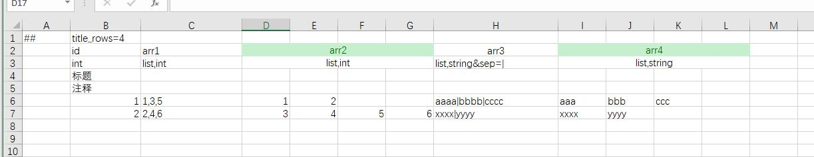
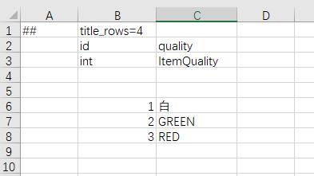
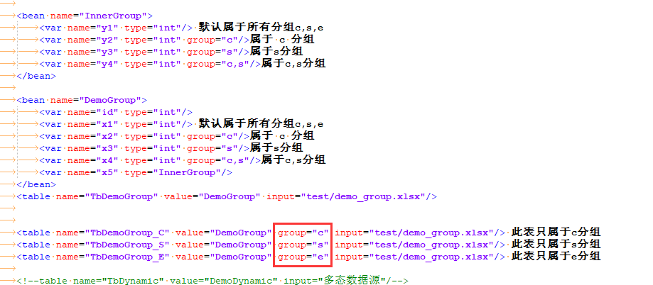
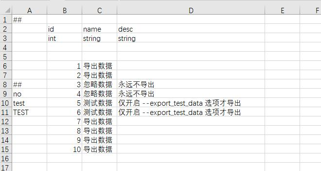
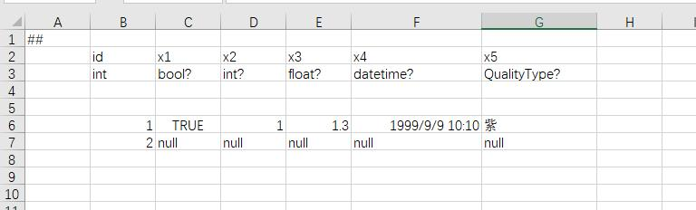
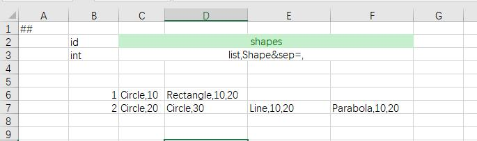

[//]: # "Author: bug"
[//]: # "Date: 2020-11-01 15:40:11"

# 增强的excel格式
luban支持在excel中解析任意复杂的数据结构，哪怕复杂如技能、行为树（但在实践中一般使用编辑器制作这些数据，以json格式保存，而不会在excel里填写）。下面从简单到复杂展示在luban中配置这些数据的方式。


## 原生数据类型

支持 bool,int,float,string,text,datetime,vector2,vector3,vector4 等等类型，它们的填写跟常规认知一致。


## 原生数据列表

array与list类型都能表示列表，它们区别在于array生成的代码为数组，而list生成代码为列表。例如"array,int"生成的c#代码类型为 int[]，而"list,int"生成的c#代码类型为 List&lt;int&gt;。

下面演示了常见的int与string的列表类型的用法,float与int用法相似。对于这些包含多个元素的数据类型，可以在一个单元格里填写，然后使用sep来分割每个元素；也可以合并标题头的列，表示这个字段占了多个单元格，每个单元格里填一个元素。

由于list,int和list,float是最常见的列表类型，它们数据中也不包含分割符，所以默认对它们使用"sep=,|"，避免填写分割符的麻烦。像list,string由于本身可能包含分割符，所以必须手动指定不与内容冲突的分割符。



## 枚举
游戏往往有枚举的需求，策划填成整数，既不清晰，程序还得手写枚举定义，麻烦又容易不一致。luban支持枚举的定义，强迫策划填写枚举名或者别名，让数据更清楚。

```xml
<enum name="ItemQuality">
	<var name="WHITE" alias="白" value="0"/>
	<var name="GREEN" alias="绿" value="1"/>
	<var name="RED" alias="红" value="2"/>
</enum>
```



## 嵌套子结构
经常会碰到，某个字段是结构，尤其这个结构在很多配置里都会复用。

假设任务中包含一个 任务线索 字段

```xml
<bean name="QuestClue">
	<var name="desc" type="string"/>
	<var name="npc_id" type="int"/>
	<var name="location" type="vector3"/>
</bean>
```


## 简单结构列表
某个字段为结构列表的情形也很常见，比如说奖励信息列表包含多个奖励信息，每个奖励都有多个字段。

假设礼包中包含一个道具信息列表字段。支持3种填写模式，具体选择由策划灵活决定。
- 所有字段完全展开，每个单元格填一个元素。缺点是占用的列较多。如items1字段。
- 每个结构占据一个单元格，使用sep分割结构子字段。如items2字段。
- 整个列表占据一个单元格，使用sep分割列表及结构子字段。如items3字段。

```xml
<bean name="Reward">
	<var name="item_id" type="int"/>
	<var name="count" type="int"/>
	<var name="desc" type="string">
</bean>
```


## 多行结构列表
有时候列表结构的每个结构字段较多，如果水平展开则占据太多列，不方便编辑，如果拆表，无论程序还是策划都不方便。此时可以使用多行填写模式，只需要定义字段属性multi_rows=1。支持任意层次的多行结构列表（也即多行结构中的每个元素也可以是多行）

假设每个任务包含多个阶段，有一个阶段列表字段。

```xml
<bean name="Stage">
	<var name="id" type="int"/>
	<var name="name" type="string"/>
	<var name="desc" type="string"/>
	<var name="location" type="vector3"/>
	<var name="reward_item_id" type="int"/>
	<var name="reward_item_count" type="int"/>
</bean>
```


## 单例表
有一些配置全局只有一份，比如 公会模块的开启等级，背包初始大小，背包上限。此时使用单例表来配置这些数据比较合适。


## 纵表

大多数表都是横表，即一行一个记录。有些表，比如单例表，如果纵着填，一行一个字段，会比较舒服。meta行添加 orientation=c 则使用纵表模式来填写内容。 上面的单例表，以纵表模式填如下。


## 引用检查
游戏配置中经常要填写诸如道具id之类的外键数据，这些数据必须是合法的id值。编辑数据过程中容易失误填了非法id或者因为配置变更导致指向的记录已经被删除了。luban支持生成时检查id的合法性，如果有误，则打出警告（不中止生成，因为开发中临时存在未修正的配置是常见现象， 不希望阻断开发工作流程）。

只要字段定义中添加 ref="表全名" 即可。不只是表顶层字段，列表及嵌套结构的子字段也支持完整的引用检查。

```xml
<bean name="Reward">
	<var name="item_id" type="int" ref="item.TbItem"/>
	<var name="count" type="int"/>
	<var name="desc" type="string">
</bean>
```


## 资源检查
配置中经常要填写资源路径，比如道具icon的资源，这些数据都是string类型，非常容易填写出错，导致运行时无法正常显示。luban支持unity与ue4资源的合法性检查以及通用型文件路径检查。不只是表顶层字段，列表及嵌套结构的子字段也支持完整的引用检查。

对于这些字段添加属性 path=unity或者path=ue或path=normal;xxxx。


## 分组导出

在大多数项目中，导出给前后端的数据并非完全相同。有些表可能仅仅前端或者后端需要，有些字段也可能仅仅前端或者后端需要。 luban同时支持两种级别的分组：
## 表级别分组

定义方式为在table中定义group属性，如果未定义 group,则默认导出给所有分组，如果定义group，则只导出给指定分组，可以多个，以逗号","分隔。

例如: TbDemoGroup_C表只给客户端使用, TbDemoGroup_S只能服务器使用, TbDemoGroup_E只给editor使用。
定义如下:



## 字段级别分组

定义方式为给var指定group属性，未指定则默认导出给所有分组。可以为多个，以逗号","分隔。相比于大多数导表工具只支持**表顶级字段**的分组导出，luban支持任意bean字段粒度级别的分组导出。

例如, TbDemoGroup表中 id,x1,x4 字段前后端都需要; x3 只有后端需要;x2 字段只有前端需要。x5是bean类型，它导出给前后端，但它的子字段也可以被分组过滤， x5.y1, x2.y4前后端都会导出，x5.x3只导出给后端,x5.x2只导出给前端。
定义如下:


## 字段默认值
我们希望excel中单元格留空时，该字段取指定值，而不是默认的false,0之类。通过定义字段的default=xxx属性来指定默认值。

如示例，id=2的记录，x1与x2皆为空，x1=0,x2=-1。


## 数据标签

开发期有时候希望临时注释掉一些记录，另外开发期经常会制作一些仅供开发使用的配置，比如测试道具，比如自动化测试使用的配置，在正式上线时不导出这些数据。 luban支持数据标签及数据注释及测试数据过滤导出，导出正式配置时不需要手动将测试数据删掉。



# 高级特性
## 层级标题头 (hierarchy title)
在多行数据或者深层次嵌套的数据中，如果数据字段较多，填写时不易区分子元素。luban提供层级标题实现深层次的子字段对应。以上面的多行数据列表为例。


## 可空数据类型
配置数据中经常有空值的语义需求，实际项目中往往混杂地使用0或-1表达空值，既不自然清晰也不统一。luban借鉴了c#中的可空变量的概念，特地提供可空数据支持。所有原生数据类型，以及enum、bean、和多态bean类型都有相应的可空数据类型。定义方式为 <类型名>?，与c#里的Nullable类型定义方式相同。例如 bool?,int?,long?,double?, EColor?, DemoType?



## 类型继承(inheritance)
支持OOP的类型继承体系，方便表达多类型的数据，常用于技能、AI等模块。类型继承是luban类型系统的灵魂，如果没有类型继承，不可能简洁地表达任意复杂数据结构，因而也不可能定义并且从配置中读取复杂的配置数据。

实践中像技能和AI之类的数据，一般用编辑器制作，使用json之类的格式保存，而不是在excel中编辑。

```xml
<bean name="Shape">
	<bean name="Circle">
		<var name="radius" type="float"/>
	</bean>
	<bean name="Rectangle" alias="长方形">
		<var name="width" type="float"/>
		<var name="height" type="float"/>
	</bean>
	<bean name="Curve">
		<bean name="Line" alias="直线">
			<var name="param_a" type="float"/>
			<var name="param_b" type="float"/>
		</bean>
		<bean name="Parabola" alias="抛物线">
			<var name="param_a" type="float"/>
			<var name="param_b" type="float"/>
		</bean>
	</bean>
</bean>

```




## 常量别名

游戏里经常会出现一些常用的类似枚举的值，比如说 升级丹的 id,在很多地方都要填，如果直接它的道具 id,既不直观，也容易出错。 Luban 支持常量替换。对于需要常量替换的字段，添加 convert=”枚举类”。 如果填写的值是 枚举名或者别名，则替换为 相应的整数。否则 按照整数解析。

``` xml
<enum name="EFunctionItemId">
	<var name="SHENG_JI_DAN" alias="升级丹" value="11220304"/>
	<var name="JIN_JIE_DAN" alias="进阶丹" value="11220506"/>
</enum>
```


导出时，升级丹会被替换为11220304。

## 多数据源
支持表数据来自excel文件；来自excel某个单元薄；来自json、xml、yaml文件；来自目录下所有文件。以及以上几种的组合。
## 来自某个excel文件
```xml
<table name="TbItem" value="Item" input="item/item1.xlsx">
```
## 来自某个excel单元薄
```xml
<table name="TbItem" value="Item" input="table1@item/item1.xlsx">
```
##
## 一个数据表来自两个excel文件
通过 excel文件1,excel文件2... 的方式指定数据表的数据来自多个文件，不同文件以逗号","分隔。当数据源为excel文件，并且没有用@来指定某个单元表时，该excel文件的中的所有单元表都会被读入。例如TbItem表的数据来自item目录下的item1.xlsx和item2.xlsx。
	
```xml
<table name="TbItem" value="Item" input="item/item1.xlsx,item/item2.xlsx">
```

## 两个数据表来自同一个excel文件的不同单元表
通过 <单元表名>@excel文件的方式指定数据来自excel文件的某个单元表，可以指定多个单元表，通过逗号","分隔。示例中TbItem占了table1、table3两个单元表；TbEquip占了table2、table4两个单元表。同一个数据表占据的单元表不必连续。示例中故意让TbItem和TbEquip占了不相邻的两个单元表。

```xml
<table name="TbItem" value="Item" input="table1@examples.xlsx,table3@examples.xlsx">
<table name="TbEquip" value="Equip" input="table2@examples.xlsx,table4@examples.xlsx">
```

## 一个数据表的数据来自**目录**下的所有文件
当以目录为数据源时，会遍历整个目录树中所有文件，除了文件名以 ",.~"（字符逗号或点号或波浪号）开头的文件外，读入每个文件中的数据。如果是excel族的数据，会从每个文件中读取多个记录，如果是xml、lua、json族的数据，每个文件当作一个记录读入。 可以有指定多个目录同时为数据源，以逗号","分隔。
```xml
<table name="TbSkill" value="Skill" input="skill_datas">
```