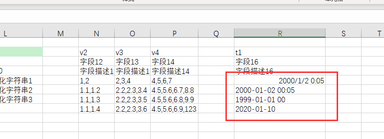
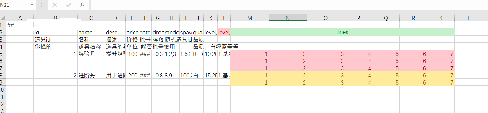

[//]: # "Author: bug"
[//]: # "Date: 2020-11-01 15:40:11"

## bool 类型

- 新增 一个字段 batch_useable，表示能否批量使用
- 用 true 或 false 表示 bool 值，只需要小写后是这两个值即可，比如 true,True,True 都是合法的值。excel 会自动将输入的值大写化。
- [定义](images/adv/def_02.png):
  ```xml
  <module name = "item">
    <bean name = "Item">
      <var name = "batch_usable" type = "bool" />
    </bean>
  </module>
  ```
- 配置:  
  

## float 类型

- 新增一个 float 类型字段，掉落概率 drop_prob.
- [定义](images/adv/def_04.png):
  ```xml
  <module name = "item">
    <bean name = "Item">
      <var name = "drop_prob" type = "float" />
    </bean>
  </module>
  ```
- 配置:  
  

## byte,short,int,long,string

  与 float 相似，不再赘述

## string 类型
填法与 float相似，但又特殊性。当string类型数据出现在**连续单元格**（比如多列bean占了多个单元格）或者用**sep分割**的数据中时，由于工具无法区别空白到底算空白字符串还是应该跳过，所以在连续多字段模式下，强制用""来表示空白字符串。

下面示例中，s1是string，单独占一个列，可以用空白单元格表示空白字符串。 cs1和cs2要么是连续单元格模式，要么是sep分割产生的连续数据模式，表达空白字符串必须用""。

可能会有疑问，如何恰好想表达 ""是怎么办呢？ 如果真遇到这种需求，再寻找解决方案吧。

定义：

```xml
	<bean name="CompactString">
		<var name="id" type="int"/>
		<var name="s2" type="string"/>
		<var name="s3" type="string"/>
	</bean>
	
	<bean name="TestString">
		<var name="id" type="int"/>
		<var name="s1" type="string"/>
		<var name="cs1" type="CompactString"/>
		<var name="cs2" type="CompactString" sep=","/>
	</bean>
	
	<table name="TbTestString" value="TestString" input="test/test_string.xlsx"/>
```

配置数据：


## text 类型

该类型数据包含两个字段, key和text， 其中 key 可以重复出现，但要求text完全相同，否则报错。这么设计是为了防止意外写重了key。**注意：不允许key为空而text不为空**

如果想填空的本地化字符串， key和text完全留空即可，工具会特殊对待，不会加入 key集合。

text的key和text字段都是string类型，因此在连续单元格或者sep产生的连续数据流模式中，同样要遵循用""来表达空白字符串的规则。

定义：

```xml
	<bean name="L10NDemo">
		<var name="id" type="int"/>
		<var name="text" type="text"/>
	</bean>
	
	<table name="TbL10NDemo" value="L10NDemo" input="l10n/Demo.xlsx"/>
```

配置数据:


## datetime 类型

- 时间是常用的数据类型。Luban 特地提供了支持。  
  有两种形式，一种以纯字符串的方式填写。
  - 以纯字符串方式填写
      填写格式为 以下 4 种。
    - yyyy-mm-dd hh:mm:ss 如 1999-08-08 01:30:29
    - yyyy-mm-dd hh:mm 如 2000-08-07 07:40
    - yyyy-mm-dd hh 如 2001-09-05 07
    - yyyy-mm-dd 如 2003-04-05
  - 以 excel内置的时间格式填写
    
- 为 Item 新增一个 失效时间字段 expire_time 。  
- [定义](images/adv/def_38.png)  
  ``` xml
  <bean name="Item">
    ...
    <var name="expire_time" type="datetime"/>
  </bean>
  ```
- 配置  
  图中红框中第一个时间以 excel的时间格式填写
  剩下第2，3，4个时间以 纯字符串形式填写

  

## 可空变量

- 有时候会有一种变量，我们希望它 功能生效时填一个有效值，功能不生效里，用一个值来表示。 例如 int 类型，常常拿 0 或者-1 作无效值常量。 但有时候，0 或-1 也是有效值时，这种做法就不生效了。或者说 项目组内 有时候拿 0，有时候拿-1 作无效值标记，很不统一。我们借鉴 sql 及 c#,引入 可空值概念，用 null 表达空值。
- 我们为 Item 添加 min_use_level 字段，类型为 int? 当填有效值时，使用时要检查等级，否则不检查。
- [定义](images/adv/def_36.png)
  ``` xml
  <bean name="Item">
    ...
    <var name="min_use_level" type="int?"/>
  </bean>
  ```
- 配置  
  

## 列表类型 list,int

- 我们新增一个字段， 宝箱的随机抽取道具列表 random_item_ids。
- [定义](images/adv/def_06.png)
  ```xml
  <module name = "item">
    <bean name = "Item">
      <var name = "random_item_ids" type = "list, int" />
    </bean>
  </module>
  ```
- 配置:  
  

## 向量类型 vector3

- vector3 有三个字段 float x, float y, float z, 适合用于表示坐标之类的数据。
- 我们新增一个 spawn_location 字段，表示物品产生的场景位置。
- [定义](images/adv/def_08.png):
  ```xml
  <module name = "item">
    <bean name = "Item">
      <var name = "spawn_location" type = "vector3" />
    </bean>
  </module>
  ```
- 配置:  
  

## 枚举类型

- 道具有品质，白绿蓝紫橙。 虽然可以直接填 1-5 这几个数据，但不直观，而且对程序非常不友好。
- 有一种更优雅的方式是定义枚举。
- [枚举定义](images/adv/def_09.png)

  ``` xml
  <enum name = "EQuality">
    <var name = "WHITE" alias = "白" value = "1">
    <var name = "GREEN" alias = "绿" value = "2">
    <var name = "BLUE" alias = "蓝" value = "3">
    <var name = "PURPLE" alias = "紫" value = "4">
    <var name = "ORANGE" alias = "橙" value = "5">
  </enum>
  ```

- 之前用 bean 来定义结构，我们引入的新的 tag “enum” 来定义 枚举。
- enum 的 name 属性表示 枚举名。
  - 如果生成 c#代码的话，会生成 cfg.item.Equality 类。
- `<var name=”xxx” alias=”xx” value=”xx”/>` 为检举项。
  - 其中 name 为必填项，不可为空，也不能重复。
  - alias 是可选项，枚举项别名。
  - value 是枚举值，主要给程序使用。
- [完整用法](images/adv/def_10.png)
  ``` xml
  <module name = "item">
    <enum name = "EQuality">
      <var name = "WHITE" alias = "白" value = "1">
      <var name = "GREEN" alias = "绿" value = "2">
      <var name = "BLUE" alias = "蓝" value = "3">
      <var name = "PURPLE" alias = "紫" value = "4">
      <var name = "ORANGE" alias = "橙" value = "5">
    </enum>
    <bean name = "Item">
      <var name = "quality" type = "EQuality">
    </bean>
  </module>
  ```
- excel 表中，想表达一个枚举值，既可以用检举项 name,也可以用枚举项的 alias，但不能是相应的整数值。
- 注意！如果想引用其他模块定义的 enum 或者 bean, type 里必须指定全名。  
  比如 type=”mall.TradeInfo” 。
- 

## bean 类型

- 有时候希望一个字段是复合类型。
- 比如，我们想用一个字段 level_range 来表示道具可以使用的等级范围，它包含两个字段，最小等级和最大等级。
- 此时，可以通过定义 bean 来解决。  
  [定义](images/adv/def_12.png)
  ``` xml
  <bean name="IntRange">
    <var name="min" type="int">
    <var name="max" type="int">
  </bean>
  <bean name="Item">
    <var name="level_range" type="IntRange">
  </bean>
  ```
- 之前的字段都在一个单元格内填写，现在这个字段是 bean 类型，有两个值，该怎么填写呢？  
  如果也像 list,int 那样把两个数写在一个单元格里(如下图)，会发现工具报错了: “10,20” 不是合法的整数值。
  
- 填写这些占据多个单元格的数据有两种办法：
  1. 合并标题头  
     让 level_range 标题头占据两列，这样就能在两个单元格里分别填写最小最大等级了。  
     
  2. 使用 sep 分割单元格  
     字段定义中指定 sep 属性，用某些字符分割单元格，这样就能识别为两个整数了。  
     [定义](images/adv/def_15.png)
     ``` xml
     <bean name="IntRange">
       <var name="min" type="int">
       <var name="max" type="int">
     </bean>
     <bean name="Item">
       <var name="level_range" type="IntRange" sep="|">
     </bean>
     ```
     如果想用 分号; 或者 竖号 | 分割，只要 sep=”;” 或者 sep=”|“ 即可。  
     

## list,bean 类型

- 有些时候，我们需要一个 结构列表字段。  
  比如说 道具不同等级会增加不同的血量。我们定义一个 ItemLevelAttr 结构。  
  [定义](images/adv/def_17.png)

  ``` xml
  <module name="item">
   <bean name="ItemLevelAttr">
      <var name="level", type="int">
      <var name="desc", type="string">
      <var name="attr", type="float">
   </bean>

   <bean name="Item">
      <var name="level_attrs" type="list,ItemLevelAttr" />
   </bean>
  </module>
  ```

  配置:  
  

- 对于多个值构成的字段，填写方式为 在标题头(level_attrs)对应的列范围内，按顺序填值。不需要跟策划的标题头名有对应关系。空白单元格会被忽略。也就是如下填法也是可以的：  
  
- 这种填法的缺点是占据在太多的列。如果想如下填，该怎么办呢？
  
- 有两种办法。
  1. bean ItemLevelAttr 增加属性 sep=”,”  
     [定义](images/adv/def_21.png)
     ``` xml
     <bean name="ItemLevelAttr" sep=",">
        <var name="level" type="int"/>
        <var name="desc" type="string"/>
        <var name="attr" type="float"/>
     </bean>
     ```
     如果不想用逗号”,” ，想用;来分割单元格内的数据，只要将 sep=”;” 即可。
  2. 字段 level_attrs 增加属性 sep=”,”，即  
     [定义](images/adv/def_22.png)
     ``` xml
     <bean name="ItemLevelAttr" sep=",">
        <var name="level" type="int"/>
        <var name="desc" type="string"/>
        <var name="attr" type="float"/>
     </bean>
     <bean name="Item">
      <var name="level_attrs" type="list,ItemLevelAttr" sep=",">
     </bean>
     ```
     如果想所有数据都在一个单元格内填写，又该怎么办呢？  
       
     想用 | 来分割不同 ItemLevelAttr ,用 , 来分割每个记录的数据。只需要 字段 level_attrs 的 sep=”,|” 即可。  
     [定义](images/adv/def_24.png)
     ``` xml
     <bean name="ItemLevelAttr" sep=",">
        <var name="level" type="int"/>
        <var name="desc" type="string"/>
        <var name="attr" type="float"/>
     </bean>
     <bean name="Item">
      <var name="level_attrs" type="list,ItemLevelAttr" sep=",|">
     </bean>
     ```

## 多态 bean

- 多态 bean 的 Luban 类型系统的核心，没有它就不可能比较方便简洁地表达游戏内的复杂数据。
- 常见的结构都是固定，但有时候会有需求，某个字段有多种类型，每种类型之间可能有一些公共字段，但它们也有一部分不一样的字段。简单的做法是强行用一个结构包含所有字段，这在类型种类较少时还勉强能工作，但类型很多，字段个数变化极大时，最终的复合结构体过于庞大笨拙，故而难以在实际采用。
- Luban 引入了 OOP 中类型继承的概念，即多态 bean。方便表达那些复杂配置需求。
- 假设 item 有一个形状 Shape 类型的字段。Shape 有两种 Circle 和 Rectangle.  
  Cicle 有 2 个字段 int id; float radius;  
  Rectangle 有 3 个字段 int id; float width; float height;  
  [定义](images/adv/def_25.png)
  ``` xml
  <bean name="Shape">
    <var name="id" type="int">
    <bean name="Circle">
      <var name="radius" type="float">
    </bean>
    <bean name="Rectangle">
      <var name="width" type="float"/>
      <var name="height" type="float"/>
    </bean>
  </bean>
  <bean name="Item">
    <var name="shape" type="Shape"/>
  </bean>
  ```
  配置:  
  
- 注意到，多态 bean 与普通 bean 填写区别在于，多态 bean 需要一个类型名。这也好理解，如果没有类型名，如何知道使用哪个 bean 呢。
- 有时间策划不太习惯填写英文，或者说类型名有时候会调整，不希望调整类型名后配置也跟着改变，因为，多态 bean 支持别名的概念。  
  [定义](images/adv/def_27.png)
  ``` xml
  <bean name="Shape">
    <var name="id" type="int"/>
    <bean name="Circle" alias="圆">
      <var name="radius" type="float"/>
    </bean>
    <bean name="Rectangle" alias="长方形">
      <var name="width" type="float"/>
      <var name="height" type="float"/>
    </bean>
  </bean>
  ```
- 配置  
  
- 使用类型名和别名来标识多态都是支持的，可以混合使用。

## multi_rows 多行 记录

- 使用数据表经常会遇到某个字段是列表类型的情形。有时候列表的 bean 的字段特别多，比如多达 10 个字段，列表包含了好几个 bean。如果此时配置成一行，会导致 excel 列过多，策划编辑维护不方便直观。 Luban 支持这个列表 多行配置。
- [定义](images/adv/def_29.png)
  ``` xml
    <bean name="MultiLineType">
      <var name="x1" type="int"/>
      <var name="x2" type="int"/>
      <var name="x3" type="int"/>
      <var name="x4" type="int"/>
      <var name="x5" type="int"/>
      <var name="x6" type="int"/>
      <var name="x7" type="int"/>
    </bean>
    <bean name="Item">
      ...
      <var name="lines" type="list,MultiLineType" multi_rows="1"/>
    </bean>
  ```
- 和 普通 非多行记录的区别在于 lines 字段多了一个 multi_rows=”1” 字段，表示这个字段要多行配置。
- 

## 多级标题头

- 经常会有字段占了多列，比如 Shape, 如果按顺序填写，有个问题在于，字段很多时，容易对应错误，不方便定位。
- 假设 有个 show_info 字段，包含 如下字段 string name; string desc; string tip;
- [定义](images/adv/def_31.png)
  ``` xml
  <bean name="ShowInfo">
    <var name="name" type="string" />
    <var name="desc" type="string" />
    <var name="tip" type="string" />
  </bean>
  <bean name="Item">
    ...
    <var name="show_info" type="ShowInfo"/>
  </bean>
  ```
- 配置  
  
- 有几处改动
  1. 我们新插入了一行标题头，第 2 行变成了两行。同时 A2,A3 单元格合并，表示标题头占了 2 行。
  2. show_info 下一行，填上 子字段名 （顺序不重要）
- 我们称之为多级标题头，通过多级标题头的方式，可以精确定位深层次字段的列。方便策划填。

## 单例表

- 不是所有数据都是 类似 map 这样的多记录结构。有些配置只有一份，比如 开启装备系统的最小角色等级。 这些数据 所在的表，也只有一个记录。称之为 单例表。
- 我们创建一个单例表，来存放这些数据。  
- [定义](images/adv/def_33.png)  
  ``` xml
  <bean name="GlobalConfig">
    <var name="unlock_equip_sys_level" type="int"/>
    <var name="unlock_mall_sys_level" type="int"/>
  </bean>
  <table name="TbGlobalConfig" value="GlobalConfig" mode="one" input="item/全局参数表.xlsx"/>
  ```
- 配置  
  

## 横表与纵表

- 之前介绍的表都是 面向行，沿着行方向填写数据。有时候我们希望 以列为方向填写。
- 比如 上面的单例表。 如果改成一行一个字段，看起来会更清楚。 我们引入纵表支持。
- 定义不变，但 excel 的填法有区别，数据如下：
- 


## 默认值

该特性只对excel格式文件有效。当单元格为空时，该字段使用默认值。

```xml
<bean name="DemoDefault">
  <var name="id" type="int"/>
  <var name="x" type="int" default="10">
</bean>

<table name="TbDemoDefault" value="DemoDefault" input="default.xlsx"/>

```


## convert 常量替换

游戏里经常会出现一些常用的类似枚举的值，比如说 升级丹的 id,在很多地方都要填，如果直接它的道具 id,既不直观，也容易出错。 Luban 支持常量替换。对于需要常量替换的字段，添加 convert=”枚举类”。 如果填写的值是 枚举名或者别名，则替换为 相应的整数。否则 按照整数解析。

定义
  ``` xml
  <enum name="EFunctionItemId">
    <var name="SHENG_JI_DAN" alias="升级丹" value="11220304"/>
    <var name="JIN_JIE_DAN" alias="进阶丹" value="11220506"/>
  </enum>
  <bean name="Item">
    <var name="cost_item_on_use" type="int" convert="EFunctionItemId"/>
  </bean>
  ```

配置: 

  
