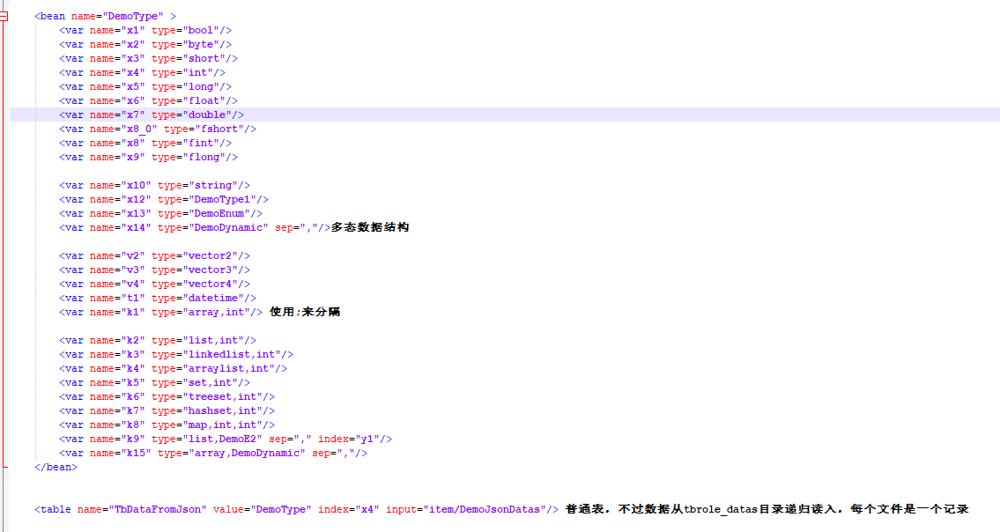
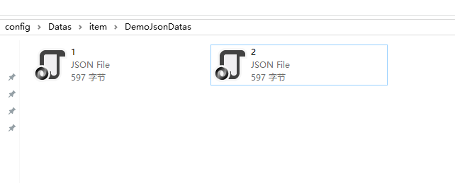
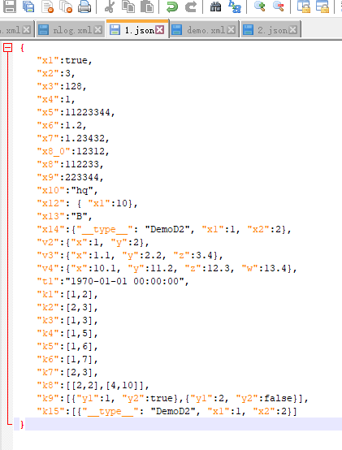

[//]: # (Author: bug)
[//]: # (Date: 2020-11-01 16:26:41)

# Json 数据

## 

* Luban 支持 json 数据为数据源。 一般来说，json数据是由编辑器制作导出的，而不像excel那样由 人工直接编辑。
* 我们新增一个定义表,覆盖了常见数据类型。  
  
* 我们在 item目录下 新增一个目录，叫 DemoJsonDatas, 里面放两个数据：  
  
* json 的内容如下：  
  
* 自行参数每种数据类型 在 json格式的填法，大多数都是合乎常理的。唯一特殊的是map类型。
* 由于json 的 key 类型必须为 string, 所以对于 map类型。数据格式为   
  ```
    [ [key1,value1], [key2, value2], ,,,] 
  ```
