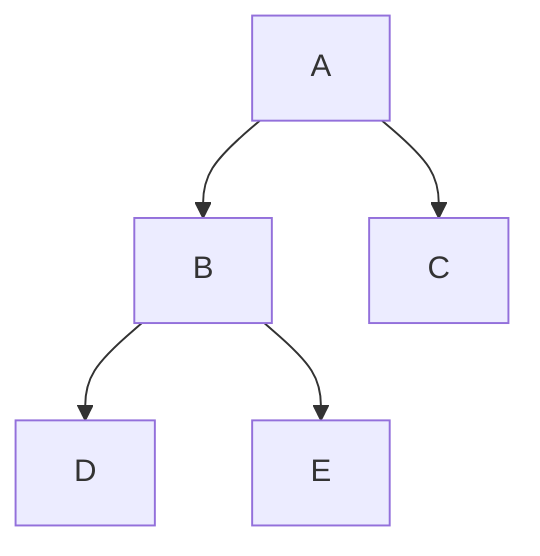

[//]: # (Author: bug)
[//]: # (Date: 2020-10-18 15:35:26)

## 特性说明
--------------------

### 支持的数据类型
* 基础内置类型
   - bool,byte,short,fshort,int,fint,long,flong,float,double,string,text,bytes
   - vector2, vector3,vector4
   - datetime
* 可空类型
   - bool?,byte?,short?,fshort?,int?,fint?,long?,flong?,float?,double?
   - vector2?,vector3?,vector4?
   - datetime?
* 自定义枚举 enum
* 自定义常量 const
* 自定义结构 bean
   - 可以定义所有类型的字段
   - 支持无限制的结构继承,对于表达中大型项目的复杂数据(技能,buff,ai 等等) 极其有用。 (比如基类Shape, 子类 Circle,Rectangle

* 支持容器类型 array。 value 可以为内置类型，也可以为自定义类型
* 支持容器类型 list。 value 可以为内置类型，也可以为自定义类型	
* 支持容器类型 set。 value 只能为内置类型或者enum类型，不支持 bean 类型
* 支持容器类型 map。 key 只能为内置类型或者enum类型，不支持 bean 类型。 value 可以为内置类型，也可以为自定义类型

### 多数据源支持 
* 支持excel族。 csv 及 xls,xlsx等格式
* 支持从指定excel里的某个单元薄读入。
* 支持json。 每个json文件当作一个记录读入
* 支持lua。 每个lua文件当作一个记录读入
* 支持xml。 每个xml文件当作一个记录读入
* 支持目录。 递归目录下的所有文件，每个文件当作一个记录读入。允许不同类型的文件混合，比如目录下可以同时有json,lua,xml,excel之类的格式。
* 允许指定多个数据源，可以使用以上所有的组合。
* 扩展新的数据源也非常容易 (像支持lua,json,xml数据源只用了200行左右代码)

### 多种数据表模式

* one 格式，即单例表模式
* map 格式，即普通key-value表模式。 任何符合set 的value要求的类型都可以做key
* bmap 格式，即双主键模式。 任何符合 set 的value要求的类型都可以作 key1和key

### 如何自定义导出分组
* 可以按照自定义需求选择性导出表及字段

### 生成极快
* 大项目几十M配置数据也能1秒导出
* 生成工具使用客户端/服务器架构
* 服务器使用多线程加速生成，数十倍提高生成速度
* 服务器使用缓存直接返回未改动的代码或者数据的生成结果
* 支持增量生成

### 增强的 excel 格式
* 支持填写任意复杂的数据（比如 常见的 list,bean 这种类型)
* 支持 sep 在单个单元格内填写多个数据
* 支持 多行数据。即 对于  list,bean 类型的字段，可以多行填写
* 支持多级标题头，对填写 层次很深的数据时非常有用
* 支持导出标记。比如  是、否、test 等等，用于标记某行数据是否导出
* 支持用 true,false表示 bool 值，语义更清晰。
* 支持枚举 alias 别名，填写枚举类型不再需要写数字了
* 支持可空变量。可以用null表达空。 某些场合下语义更清晰。
* 支持 datetime 数据类型. 时间格式标准为以下几种，最终被转化为utc时间方便程序处理
    - yyyy-MM-dd HH:mm:ss
    - yyyy-MM-dd HH:mm
    - yyyy-MM-dd HH
    - yyyy-MM-dd

###  代码编辑器支持
* 根据配置表定义生成相应的json文件的 load 及 save 代码(c#或者c++)，方便编辑器加载和导出。每个记录对应一个json文件。
* 支持 unity 下用c# 开发编辑器
* 支持 unreal 下用c++ 开发的编辑器 

### 支持多种导出数据格式
* **导出格式与源数据解耦**。无论源数据是 excel、lua、xml、json 或者它们的混合, 最终都被以统一的格式导出，极大简化了生成代码的复杂性。
* 导出binary。 内置binary格式，加载最快，占空间最少。
* 导出json 格式
* 导出 lua 格式
* 非常容易扩展其他输出格式(一般来说不到300行代码)

### 本地化支持
* 支持**本地化时间**。 配置中的 datetime会根据指定的timezone及localtime转化为正确的utc时间，方便程序处理
* 支持**静态本地化**。 配置中的text类型在导出时已经转化为正确的本地化后的字符串
* 支持**动态本地化**。 配置中的text类型能运行时全部切换为某种本地化后的字符串

### 代码编辑器支持
  * 支持 emmylua anntations。生成的lua包含符合emmylua 格式anntations信息。配合emmylua有强大的配置代码提示能力。

### 强大的数据校验能力
* 完整的数据内建约束检查
* ref 检查。检查表引用合法性。
* path 检查。检查资源引用合法性，对于防止策划填错极其有用，不再需要运行时才发现资源配置错误了。
* range 检查。检查数值范围。
* 扩展的自定义检查。使用自定义代码进行高级检查。提交配置前就能完成本地检查，避免运行时才发现错误，极大减少迭代成本。

### 资源导出支持  
* 支持 res 资源标记。可以一键导出配置中引用的所有资源列表(icon,ui,assetbundle等等)

### 优秀的代码生成
- 良好模块化。比如对于c#语言生成cfg.item.Item,cfg.equip.EquipInfo这样的类
- 内存性能优化。支持c#值类型以及lua的紧凑格式保存数据，节约内存。
- 支持为ref的字段生成resolve后的字段定义及加载后设置。读取所引用的字段不用再查表了。
- 支持对 list 类型数据 生成 index, 方便按列表和索引方式访问的需求。

### 良好的数据组织 
- 数据模块化。允许策划按模块目录自由组织数据。
- 数据多源化。允许策划按需求选择最合适的源数据类型。

### 支持的语言 (覆盖主流的语言)
* 支持 c# (所有 .net framework 2 及以上, .net core平台)
* 支持 java (java 1.6 及以上)
* 支持 c++ ( c++ 11 及以上)
* 支持 go
* 支持 lua (5.1 及以上)
* 支持 typescript
* **新增其他语言支持非常容易**
 
### 支持的服务器引擎（满足语言版本的情况下)
* 纯 c# 的所有引擎
* 纯 java 的所有引擎
* 纯 go 的所有引擎
* 纯 c++ 的所有引擎
* 纯 lua 的所有引擎
* 纯 js或typescript的所有引擎

### 支持的客户端引擎（满足语言版本的情况下)
* unity + c# 
* unity + tolua
* unity + xlua
* unity + ILRuntime
* cocosx-lua
* cocosx-js
* unreal + 纯 c++
* unreal + unlua
* unreal + puerts (typescript)
* 支持微信小程序和小游戏 sdk
* 支持 lua 的其他任何引擎
* 支持 js 或 typescript的 其他任何引擎
	
### 强大的扩展能力
* 支持插件形式，扩展其他生成极其方便