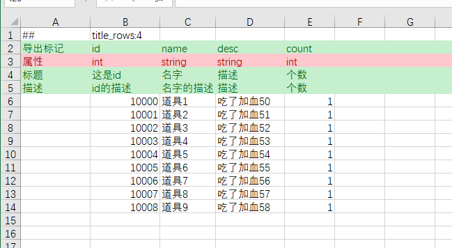

# 安装与执行

## 安装

1. dotnet sdk 5.0 （已安装的可跳过）
2. 下载 luban.client&luban.server ，来自[luban_examples](https://github.com/focus-creative-games/luban_examples) 的 Tools目录
3. 启动 luban.server  
   直接双击 运行即可。运行生成脚本需要连接到 luban.server,请保持它运行。

## 创建游戏配置

1. 创建目录结构  
   config 为根目录，下面创建两个子目录 Datas 和 Defines，分别用于 存放策划 excel 及各种配置数据 以及 配置定义。
   
2. 在 Defines 目录下创建 root.xml 根定义文件  
     
   可以直接从 demo 项目拷贝这个文件。
   这个 root 文件描述了：

3. 生成代码的默认顶层命名空间为 cfg
4. 有 3 个分组 c,s,e 对应 client，server，editor 分组。 分组用于配置选择性导出。后面再介绍。
5. import name=”.” 表明从当前目录导入所有子模块定义文件。我们会把所有子模块定义文件也放到 Defines 目录下。
6. server 表示最终输出的目标。当前定义了 4 个目标。service 的 group 属性指明了这个目标会包含哪些分组。  
   例如： server 目标就只包含 s 分组，而 all 目标包含了所有分组。  
   我们先不细究这些定义的含义。

7. 创建第一个配置表 物品表

8. 添加物品表 excel 文件
   我们可以直接在 Datas 目录下添加 物品表.xlsx 文件，不过如果所有表都放到 Datas 目录下，查找起来很不方便。  
   为了方便，我们按模块组织配置文件，在 Datas 目录下新建一个 item 目录，目录下创建一个 “物品表.xlsx” 文件。  
    

   - 第 1 行是 meta 行。有一些关于 excel 文件的元描述，默认全空，使用默认默认值即可。  
     单元格 A1 必须是 ##。表示这是一个有效数据表。
   - 第 2 行是程序字段名行。
   - 第 3 行是标题头行。策划自行填写，可留空。
   - 第 4 行是描述行。策划可以填写字段的补充描述。可留空。
   - 从第 5 开始为实际的数据行。如果某个数据行整行为空，则会被跳过。

   我们定义一个简单的物品表，有 4 个字段。

   - id 道具 id
   - name 道具名
   - desc 道具描述
   - price 道具购买价格

9. 创建定义  
   我们已经填好了第一个配置表，此时应该会有疑问：

   1. 字段类型呢？字段类型怎么没有定义啊？
   2. 生成的代码中相关的类名又在哪儿获得呢？
   3. 如何导出？最终导出的数据在哪个文件？ 导出文件又是啥格式？  
      每个配置表都需要在某个子模块定义文件中添加一个相应的定义描述，每个模块可以包含多个表定义。  
      我们在 Defines 目录创建 item.xml，item.xml 是一个子模块定义文件，用于包含物品模块的所有结构，枚举及配表定义。  
      接着在 item.xml 里添加物品表相关定义。

      

   - 简略介绍一下定义:
     - table 是表定义，每个表都有一个对应的表定义。
     - name 表名。推荐采取 TbXXXX 这种名字约定。
     - value 记录的类型。即配置表里每行记录的类型。
     - index 以 value 的哪个字段为主键。这里用 Item 结构里的 id 字段做主键
     - input 数据源。这个表的数据文件来源，相对 Datas 目录。可以是多个，以英文分号 ; 分割。
     - bean 用于定义公用结构，同时也用于定义表记录结构。
     - name 类型名。 这儿取 Item，最终生成的 c#代码会使用 cfg.item.Item 这样的类名。
     - var 用于定义字段。
       - name 字段名。推荐统一 xx_yy_zz 这种风格。
       - type 字段类型。 可以是 bool,int,float,string 等等，完整的类型参见链接。

10. 至此,物品表的创建工作大功告成!

## 生成代码和数据以及在程序中使用

- 根据前后端以及引擎和平台类型以及所用语言，介绍常见组合下，如何生成代码和数据。

  1.  项目准备。  
      拷贝示例项目中 Csharp_DotNetCore_bin\Core 目录到项目中，可以自由组织位置。  
      此时尝试编译项目，理论上应该能成功编译。
  2.  运行生成命令  
    

      ```bat
      <luban.client>
      -h 127.0.0.1 ^
      -p 8899 ^
      -j cfg ^
      --^
      --define_file <root.xml 定义文件的路径>^
      --input_data_dir <配置数据根目录(Datas)的路径>^
      --output_code_dir <输出的代码文件的路径>^
      --output_data_dir <导出的数据文件的路径>^
      --service server^
      --export_test_data^
      --gen_types "code_cs_bin,data_bin"
      ```

      **============提醒=============**

      **如果你们项目使用json导出格式，需要将 --gen_types的参数改为 "code_cs_json,data_json"**

      **如果你们项目使用typescript并且json导出格式，需要将 --gen_types的参数改为 "code_typescript_json, data_json"**

      更多语言或者导出类型的组合，请参考 [luban_examples](https://github.com/focus-creative-games/luban_examples)

      **=============================**

      如果一切正常，会产生一系列日志，最终一行是 == succ == 。
      

      如果遇到 类似这样的错误，说明服务器未启动。 双击启动 luban.server 即可。
      
      

      如果一切顺利。生成的代码文件会在 –output_code_dir 参数指定的 目录中，生成的配置数据会在 –output_data_dir 参数指定的目录中。  
      把 –output_code_dir 加入到 项目中，编译。此时应该能编译成功。

  3.  加载配置  
      只需一行代码既可完成所有配置表的加载工具

      ```c#
          var tables = new cfg.Tables(file =>
              new Bright.Serialization.ByteBuf(
                  System.IO.File.ReadAllBytes( < --output_data_dir 指向的生成数据目录> + “/” + file)));
      ```

      

  4.  使用加载后的配置表
      cfg.Tables 里包含所有配置表的一个实例字段。  
      加载完 cfg.Tables 后，只需要用 tables.<表名> 就能获得那个表实例，接着可以做各种操作。  
      例如我们要访问 id = 1 的那个记录。代码如下

      ```
          cfg.item.Item itemInfo = tables.TbItem.Get(1);
          Console.WriteLine(“{0} {1} {2} {3}”,
          itemInfo.Id, itemInfo.Name, itemInfo.Desc,itemInfo.Price)
      ```

      可能你会注意到，item.xml 里定义 Item 时，字段名 id,name,desc,price 首字母被大写了。
      工具会根据输出的语言，自动作相应代码风格的字段名转换，也即 boo_bar 会被转换为 BooBar 这样的名字。
      这也是为什么推荐 配置字段定义时统一使用 xx_yy_zz 的风格。

  5.  至此完成 配置加载与使用!
