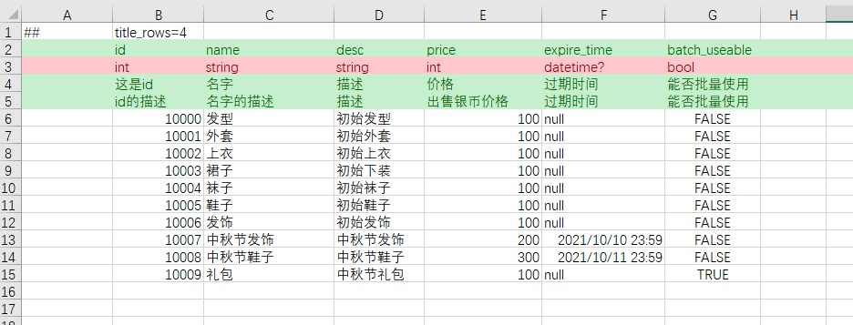

# 安装与执行

## 安装

1. dotnet sdk 5.0 
1. 下载luban_examples项目

    下载项目 [luban_examples](https://github.com/focus-creative-games/luban_examples)。
    项目中包含测试配置、最新的luban_client&luban_server工作以及大量的示例项目。为方便起见，后续提及到的文件，默认都指这个项目中的文件。

## 快速开始

以创建一个道具表为例

1. 新建item.xlsx表
     

1. 在__tables__.xlsx里添加一行
    

1. 假设我们为unity客户端生成c#代码和json数据，命令如下:
    ```bat
    ; 请正确设置以下宏的值
    ; set LUBAN_CLIENT= dotnet %LUBAN_CLIENTSERVER_DIR%/Luban.ClientServer.dll
    ; set ROOT_DEFINE_FILE=%CONF_ROOT%/Defines/__root__.xml
    ; set INPUT_DATA_DIR=%CONF_ROOT%/Datas
    ; set OUTPUT_DATA_DIR=GameData
    ; set OUTPUT_CODE_DIR=Assets/Gen

    %LUBAN_CLIENT% -j cfg --^
    -d %ROOT_DEFINE_FILE% ^
    --input_data_dir %INPUT_DATA_DIR% ^
    --output_code_dir %OUTPUT_CODE_DIR% ^
    --output_data_dir %OUTPUT_DATA_DIR% ^
    --gen_types code_cs_unity_json,data_json ^
    -s all ^
    --export_test_data
    ```

1. 最终在 %OUTPUT_CODE_DIR%目录下生成代码，在%OUTPUT_DATA_DIR%目录下生成数据。生成的数据文件中 item_tbitem.json文件内容如下 (只截取部分)
    ```json
    [
        {
            "id": 10000,
            "name": "发型",
            "desc": "初始发型",
            "price": 100,
            "batch_useable": false
        },
        {
            "id": 10001,
            "name": "外套",
            "desc": "初始外套",
            "price": 100,
            "batch_useable": false
        },
        {
            "id": 10002,
            "name": "上衣",
            "desc": "初始上衣",
            "price": 100,
            "batch_useable": false
        }
    ]
    ```

1. 加载及使用配置示例
    ```c#
    // 一行代码可以加载所有配置。 cfg.Tables 包含所有表的一个实例字段。
    var tables = new cfg.Tables(file => new ByteBuf(File.ReadAllBytes($"{gameConfDir}/{file}.json")));

    // 获得道具配置并且打印
    cfg.Item item = tables.TbItem.Get(10001)
    Console.WriteLine("name:{0} desc:{1} price:{2}", item.Name, item.Desc, item.Price);

    ```

