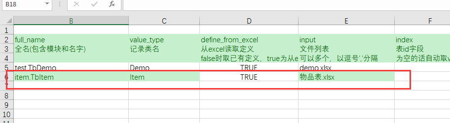
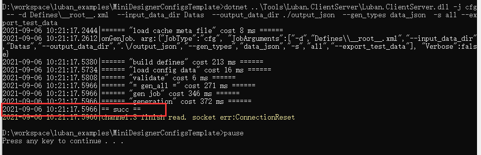

# 安装与执行

## 安装

1. dotnet sdk 5.0 
1. 下载luban_examples项目

    下载项目 [luban_examples](https://github.com/focus-creative-games/luban_examples)。
    项目中包含测试配置、最新的luban_client&luban_server工作以及大量的示例项目。为方便起见，后续提及到的文件，默认都指这个项目中的文件。

## 创建游戏配置

1. 创建目录结构  
   config 为根目录，下面创建两个子目录 Datas 和 Defines，分别用于 存放策划 excel 及各种配置数据 以及 配置定义。
   
2. 在 Defines 目录下创建 \_\_root__.xml 根定义文件  
```xml
<root>

	<topmodule name="cfg"/>

	<branch name="cn"/>
	<branch name="tw"/>
	<branch name="en"/>
	<branch name="jp"/>

	<group name="c" default="1"/> client
	<group name="s" default="1"/> server
	<group name="e" default="1"/> editor
	
	<import name="."/>
	
	<importexcel name="tables.xlsx" type="table"/> 补充table表声明。文件相对data目录
	<importexcel name="enums.xlsx" type="enum"/> 补充enum定义。相对data目录
	<importexcel name="beans.xlsx" type="bean"/> 补充bean定义。相对data目录

	<service name="server" manager="Tables" group="s"/>
	<service name="client" manager="Tables" group="c"/>
	<service name="all" manager="Tables" group="c,s,e"/>
</root>
```

可以直接从 [示例配置](https://github.com/focus-creative-games/luban_examples/tree/main/DesignerConfigs/Defines) 拷贝这个文件。


4. 添加物品表 excel 文件
    在 Datas 目录下新建一个 item 目录，目录下创建一个 “物品表.xlsx” 文件。  
   
    
   
   文件内容如下

   

   - 第 1 行是 meta 行，包含关于excel文件的元描述，title_rows:4表示除了meta行外，有4行标题头。  
     单元格 A1 必须是 ##。表示这是一个有效数据表。
   - 第 2 行是程序字段名行。
   - 第3行是属性行。格式为 type&属性1=值1&属性2=值2 ...
   - 第 4 行是标题头行。策划自行填写，可留空。
   - 第 5 行是描述行。策划可以填写字段的补充描述。可留空。
   - 从第 6 开始为实际的数据行。如果某个数据行整行为空，则会被跳过。

然后再在 Datas 目录下的tables.xlsx（请从 DesignerConfigs/Datas目录拷贝过来）添加表声明。如下图：




10. 至此,物品表的创建工作大功告成!

## 生成代码和数据以及在程序中使用


1.  项目准备。  

拷贝示例项目中 Csharp_DotNetCore_bin\Core 目录到项目中，可以自由组织位置。  此时尝试编译项目，理论上应该能成功编译。

2.  运行生成命令  
    
```bat
      dotnet <luban.clientserver.dll>
      -j cfg ^
      --^
      --define_file <root.xml 定义文件的路径>^
      --input_data_dir <配置数据根目录(Datas)的路径>^
      --output_code_dir <生成的代码文件的路径>^
      --output_data_dir <导出的数据文件的路径>^
      --service all^
      --export_test_data^
      --gen_types "code_cs_bin,data_bin"
 ```

其中 

- <luban.clientserver.dll> 指向  Tools/Luban.ClientServer/Luban.ClientServer.dll
- <root.xml定义文件路径> 指向 Define/__root__.xml


详细的命令文档请看 [install_manual](./luban_install_manual.md)。

更多语言或者导出类型的组合，请参考 [luban_examples](https://github.com/focus-creative-games/luban_examples)


如果一切正常，会产生一系列日志，最终一行是 == succ == 。




如果一切顺利。生成的代码文件会在 –output_code_dir 参数指定的 目录中，生成的配置数据会在 –output_data_dir 参数指定的目录中。  
把 –output_code_dir 加入到 项目中，编译。此时应该能编译成功。

3.  加载配置  
      
只需一行代码既可完成所有配置表的加载工具

```c#
    var tables = new cfg.Tables(file =>
        new Bright.Serialization.ByteBuf(
            System.IO.File.ReadAllBytes( <output_data_dir 指向的生成数据目录> + "/" + file)));
```


4.  使用加载后的配置表
    cfg.Tables 里包含所有配置表的一个实例字段。  
    加载完 cfg.Tables 后，只需要用 tables.<表名> 就能获得那个表实例，接着可以做各种操作。  
    例如我们要访问 id = 1 的那个记录。代码如下


```c#
    cfg.item.Item itemInfo = tables.TbItem.Get(1);
    Console.WriteLine(“{0} {1} {2} {3}”,
    itemInfo.Id, itemInfo.X1, itemInfo.X2,itemInfo.X3)
```


可能你会注意到，item.xml 里定义 Item 时，字段名 id,x1,x2,x3 首字母被大写了。工具会根据输出的语言，自动作相应代码风格的字段名转换，也即 boo_bar 会被转换为 BooBar 这样的名字。这也是为什么推荐 配置字段定义时统一使用 xx_yy_zz 的风格。

  5.  至此完成 配置加载与使用!
