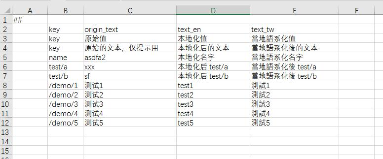

## 本地化

### 静态本地化

单独提供了text类型来支持文本的本地化。 text类型由两个字段构成, key和value。 考虑到大多数项目是优先做了主地区配置后，再进行本地化，因此luban特地支持在配置中原地填写text的key和主地区文本值。制作其他地区配置时，通过指定本地化映射表的方式，再将该text转换为目标语言的文本值。


主语言导出数据为 (只截取了部分数据)

```json
[
  {
    "id": 11,
    "text": {
      "key": "/demo/1",
      "text": "测试1"
    }
  },
  {
    "id": 12,
    "text": {
      "key": "/demo/2",
      "text": "测试2"
    }
  },
  {
    "id": 13,
    "text": {
      "key": "/demo/3",
      "text": "测试3"
    }
  }
]
```

制作本地化映射表 



映射到英语后的导出数据（只截取了部分数据）为
```json
[
  {
    "id": 11,
    "text": {
      "key": "/demo/1",
      "text": "test1"
    }
  },
  {
    "id": 12,
    "text": {
      "key": "/demo/2",
      "text": "test2"
    }
  },
  {
    "id": 13,
    "text": {
      "key": "/demo/3",
      "text": "test3"
    }
  }
]
```

### 动态本地化
运行时动态切换语言到目标语言。

生成的cfg.Tables包含TranslateText函数， 以c#为例。只需要提供一个 (string key, string origin_value) -> (string target_value) 的转换器，
就能自动将所有配置表中的text类型字段替换为目标语言的文本。程序不需要根据id去本地化映射表里查询，简化了使用。

```c#
public void TranslateText(System.Func<string, string, string> translator)
{
	TbItem.TranslateText(translator);
	...
}
```

### 多分支 数据
支持 main + patches的数据模式。在主版本数据基础上，提供一个补丁数据，合并处理后生成最终目标数据。适合制作海外有细节配置不同的多地区配置，不需要
复制出主版本数据，接着在上面修改出最终数据。极大优化了制作本地化配置的工作流。


### 时间本地化
datetime类型数据在指定了本地化时区后，会根据目标时区，生成相应时刻的UTC时间，方便程序使用
