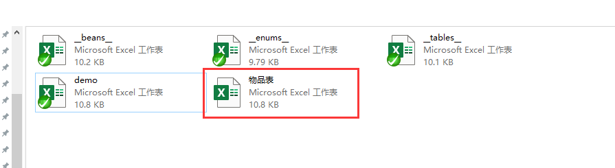

# 安装与执行

## 安装

1. [dotnet sdk 6.0](https://dotnet.microsoft.com/download/dotnet/6.0)
1. 下载luban_examples项目

    下载项目 [luban_examples](https://github.com/focus-creative-games/luban_examples)。
    项目中包含测试配置、最新的luban_client&luban_server工作以及大量的示例项目。为方便起见，后续提及到的文件，默认都指这个项目中的文件。

## 创建游戏配置

1. 从示例项目拷贝[MiniDesignerConfigsTemplate](https://github.com/focus-creative-games/luban_examples/MiniDesignerConfigsTemplate) 到一个合适的目录，假设为 **MyConfigs**
2. 添加物品表 excel 文件
    在 MyConfigs/Datas 目录下创建一个 “物品表.xlsx” 文件。  
   
    
   
   文件内容如下

   |##|id|name|desc|count|
   |-|-|-|-|-|
   |##type|int|string|string|int|
   |##|id|名字|描述|个数|
   ||1001|item1| desc1| 10|
   ||1002|item2| desc2| 10|
   ||1003|item3| desc3| 10|
   ||1004|item4| desc4| 10|


   - 第 1 行是 主字段行，包含表字段定义。单元格 A1 必须是 ##。表示这是一个有效数据表。
   - 第 2 行是类型行，第1个单元格必须为 ##type。
   - 第 3 行是注释行。 以##开头。 可以有0-N个注释行，而且可以出现在任何位置
   - 第 4 行起是数据行。

3. 在 Datas 目录下的__tables__.xlsx添加表声明。如下图：

|##|full_name|value_type|define_from_excel|input|index|mode|group|comment|patch_input|tags|output|
|-|-|-|-|-|-|-|-|-|-|-|-|
||demo.TbItem|Item|true|物品表.xlsx||||||||

4. 至此,物品表的创建工作大功告成!

## 生成代码和数据以及在程序中使用

 假设是Unity项目，使用json导出格式。 示例参考项目为 [Csharp_Unity_Json](https://github.com/focus-creative-games/luban_examples/Projects/Csharp_Unity_json)。其他语言或者导出类型的组合，请参考 [luban_examples](https://github.com/focus-creative-games/luban_examples)


1.  项目准备。  

拷贝示例项目中 Assets\LubanLib 目录到你的Unity项目中（可以自由组织位置），此时尝试编译项目，理论上应该能成功编译。

2.  运行生成命令（可以参考示例项目的gen_code_json.bat）

```bat
      dotnet <Luban.ClientServer.dll>
      -j cfg ^
      -- ^
      --define_file <__root__.xml 定义文件的路径> ^
      --input_data_dir <配置数据根目录(Datas)的路径> ^
      --output_code_dir <生成的代码文件的路径> ^
      --output_data_dir <导出的数据文件的路径> ^
      --service all ^
      --gen_types "code_cs_json,data_json"
 ```

其中 

- <Luban.ClientServer.dll> 指向  Tools/Luban.ClientServer/Luban.ClientServer.dll
- --define_file  参数为 <MyConfigs>/Defines/\_\_root\_\_.xml 的路径
- --input_data_dir 参数为 <MyConfigs>/Datas 的路径
- --output_code_dir 参数为生成的代码文件存放的路径。 建议建议指向 unity的 Assets 目录下的某级子目录
- --output_data_dir 参数为生成的数据文件的存放路径。

详细的命令文档请看 [install_manual](./luban_install_manual.md)。

如果一切正常，会产生一系列日志，最终一行是 == succ == 。

类似这样

 


如果一切顺利。生成的代码文件会在 –output_code_dir 参数指定的 目录中，生成的配置数据会在 –output_data_dir 参数指定的目录中。把 –output_code_dir  加入到 项目中，编译。此时应该能编译成功。

3.  加载配置  
      
只需一行代码既可完成所有配置表的加载工具

```c#
var tables = new cfg.Tables(file => JSON.Parse(File.ReadAllText(gameConfDir + "/" + file + ".json")));
```

4.  使用加载后的配置表

cfg.Tables 里包含所有配置表的一个实例字段。加载完 cfg.Tables 后，只需要用 tables.<表名> 就能获得那个表实例，接着可以做各种操作。例如我们要获取id = 10000 的那个道具。代码如下

```c#
cfg.item.Item itemInfo = tables.TbItem.Get(10000);
Console.WriteLine("id:{0} name:{1} desc:{2}", itemInfo.Id, itemInfo.Name, itemInfo.Desc);
```


可能你会注意到，item.xml 里定义 Item 时，字段名 id,name,desc的首字母被大写了。这是因为工具会根据输出的语言，自动作相应代码风格的字段名转换，也即 boo_bar 会被转换为 BooBar 这样的名字。这也是为什么推荐 配置字段定义时统一使用 xx_yy_zz 的风格。

  5.  至此完成 配置加载与使用!
