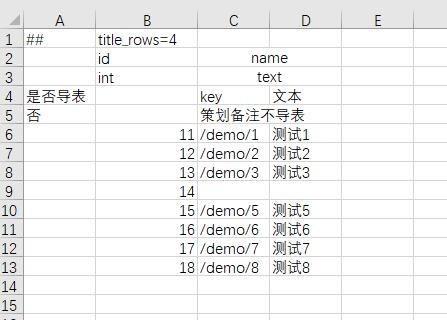
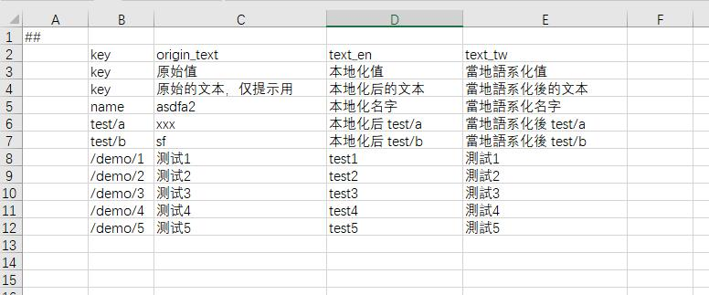

[//]: # (Author: bug)
[//]: # (Date: 2021-09-26 22:28:20)

# 本地化

## 静态本地化

- 单独提供了text类型来支持文本的本地化。 text类型由两个字段构成, key和value。 考虑到大多数项目是优先做了主地区配置后，再进行本地化，因此luban特地支持在配置中原地填写text的key和主地区文本值。制作其他地区配置时，通过指定本地化映射表的方式，再将该text转换为目标语言的文本值。
- 

1. 主语言导出数据为 (只截取了部分数据)
    ```json
    [
    {
        "id": 11,
        "text": {
        "key": "/demo/1",
        "text": "测试1"
        }
    },
    {
        "id": 12,
        "text": {
        "key": "/demo/2",
        "text": "测试2"
        }
    },
    {
        "id": 13,
        "text": {
        "key": "/demo/3",
        "text": "测试3"
        }
    }
    ]
    ```

2. 制作本地化映射表 

    

3. 映射到英语后的导出数据（只截取了部分数据）为
    ```json
    [
    {
        "id": 11,
        "text": {
        "key": "/demo/1",
        "text": "test1"
        }
    },
    {
        "id": 12,
        "text": {
        "key": "/demo/2",
        "text": "test2"
        }
    },
    {
        "id": 13,
        "text": {
        "key": "/demo/3",
        "text": "test3"
        }
    }
    ]
    ```

## 动态本地化
- 运行时动态切换语言到目标语言。
- 生成的cfg.Tables包含TranslateText函数， 以c#为例。只需要提供一个 (string key, string origin_value) -> (string target_value) 的转换器，
就能自动将所有配置表中的text类型字段替换为目标语言的文本。程序不需要根据id去本地化映射表里查询，简化了使用。
- 
    ```c#
    public void TranslateText(System.Func<string, string, string> translator)
    {
        TbItem.TranslateText(translator);
        ...
    }
    ```